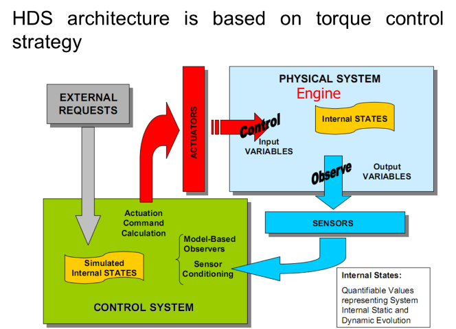

.. include:: <isonum.txt>
.. include:: ../_static/figures.txt
.. include:: ../_static/app/figures.txt

.. sectnum::
    :prefix: Appendix_
    :depth: 3
    :start: 1

|logo|

HDS CAN Configuration and usages
================================

.. _can_settings:

Synoptic table
--------------

HDS9 features 4 CAN buses each of them dedicated to a function:

.. table:: Synoptic table of CAN BUSes on HDS ECU
    :widths: auto

    +---------------------------+--------------+--------------------+----------------------------------------------------+
    |CAN Number and ECU Pins    | Protocol     |  Functions                                                              |
    |                           |              +-------------+-----------------+--------------+------------+-------------+
    |                           |              | Calibration | SW FW Download  | Vehicle BUS  | Diagnosis  | Smart dev.  |
    +===========================+==============+=============+=================+==============+============+=============+
    | CAN #1 - Hi B82 - Lw B81  | XCP on CANFD | OK          | OK              | NO           | NO         | NO          |
    +---------------------------+--------------+-------------+-----------------+--------------+------------+-------------+
    | CAN #2 - Hi B88 - Lw B87  | J1939        | NO          | NO              | OK           | OK         | OK          |
    +---------------------------+--------------+-------------+-----------------+--------------+------------+-------------+
    | CAN #3 - Hi B86 - Lw B85  | UDS          | NO          | YES             | NO           | OK         | NO          |
    +---------------------------+--------------+-------------+-----------------+--------------+------------+-------------+
    | CAN #4 - Hi B84 - Lw B83  | private      | NO          | NO              | NO           | NO         | YES         |
    +---------------------------+--------------+-------------+-----------------+--------------+------------+-------------+

CAN#1
-----

Usage
+++++

.. TODO: develop the CAN usages descriptions

Before starting the calibration of a new engine on the test bench, it’s necessary to have a complete control of all engine system, from air intake to exhaust gas. In particular it’s mandatory to control the temperatures of the head engine and of turbine inlet and outlet in order to maintain them, during the calibration, lower than limits fixed for materials.
As engine instrumentation has to be customized for each application it’s not possible to give detailed instructions always valid.
For the calibration work a typical engine instrumentation is reported in FIGURE below:

    A scheme of the instrumentation

The functions and priority of single instrumentation are in table below

.. table:: Recommended instrumentation for HDS application development
    :widths: auto

    +--------------------------+--------------------------------------------+------------------------------+
    | Instrumentations         |    Functions                               |  Priority                    |
    +==========================+============================================+==============================+
    |  Mass air flow meter     |    to calibrate the speed density model    |  Mandatory                   |
    +--------------------------+--------------------------------------------+------------------------------+
    |  Cyl. Press. Sensors     |    monitoring combustion                   |  Mandatory at least one cyl. |
    +--------------------------+--------------------------------------------+------------------------------+
    |  UEGO sensor             |    to verify Air Fuel Ratio                |  Mandatory                   |
    +--------------------------+--------------------------------------------+------------------------------+
    |  T inlet turbocharger    |   to estimate turbocharger work,           |  Mandatory                   |
    +--------------------------+   material stress and                      +------------------------------+
    |  T outlet turbocharger   |   to improve efficiency during calibration |  Optional                    |
    +--------------------------+--------------------------------------------+------------------------------+
    |  T exhaust single ducts  |   monitor combustion balance among cyls.   |  Optional                    |
    +--------------------------+--------------------------------------------+------------------------------+
    |  T in / out catalyst     |    to verify catalyst efficiency           |  Optional                    |
    +--------------------------+--------------------------------------------+------------------------------+
    |  Environment conditions  |    to set the base parameters              |  Optional                    |
    +--------------------------+--------------------------------------------+------------------------------+

.. sidebar:: Hot-Film Air-Mass Meters
    :subtitle: A standard Automotive Mass Production Components

    |can_020|

