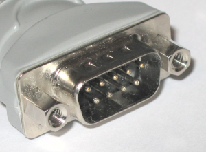
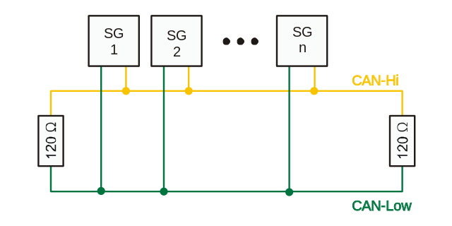
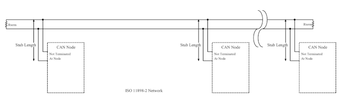

.. include:: <isonum.txt>
.. include:: ../_static/figures.txt
.. include:: ../_static/app/figures.txt

.. sectnum::
    :prefix: Appendix_
    :depth: 3
    :start: 1

|logo|

HDS CAN Configuration and usages
================================

.. _can_settings:

Synoptic table
--------------

HDS9 features 4 CAN buses each of them dedicated to a function:

.. table:: Synoptic table of CAN BUSes on HDS ECU
    :widths: auto

    +---------------------------+--------------+--------------------+----------------------------------------------------+
    |CAN Number and ECU Pins    | Protocol     |  Functions                                                              |
    |                           |              +-------------+-----------------+--------------+------------+-------------+
    |                           |              | Calibration | SW FW Download  | Vehicle BUS  | Diagnosis  | Smart dev.  |
    +===========================+==============+=============+=================+==============+============+=============+
    | CAN #1 - Hi B82 - Lw B81  | XCP on CANFD | OK          | OK              | NO           | NO         | NO          |
    +---------------------------+--------------+-------------+-----------------+--------------+------------+-------------+
    | CAN #2 - Hi B88 - Lw B87  | J1939        | NO          | NO              | OK           | OK         | OK          |
    +---------------------------+--------------+-------------+-----------------+--------------+------------+-------------+
    | CAN #3 - Hi B86 - Lw B85  | UDS          | NO          | YES             | NO           | OK         | NO          |
    +---------------------------+--------------+-------------+-----------------+--------------+------------+-------------+
    | CAN #4 - Hi B84 - Lw B83  | private      | NO          | NO              | NO           | NO         | YES         |
    +---------------------------+--------------+-------------+-----------------+--------------+------------+-------------+

The 4 CAN lines are provided with embedded 120 Ohm terminations.

In a peer to peer connection, as the one aver CAN 1 for calibration system the other terminal must be terminated with 120 Ohm as well.

In multiple nodes connection, for example in vehicle CAN 2, where is possible to have connected the ECU, the :term`IC`, the :term:`VCM`, :term:`TCM` the balncing of the termination must be designed with accurately. This competence is in charge of Vehicle manufacturer engineering.

CAN connection generalities
---------------------------

Connection
++++++++++
`From Wikipedia, the free encyclopedia <https://en.wikipedia.org/wiki/CAN_bus#Layers>`_

An automotive ECU will typically have a particular—often custom—connector with various sorts of cables, of which two are the CAN bus lines. Nonetheless, several de facto standards for mechanical implementation have emerged, the most common being the 9-pin D-sub type male connector with the following pin-out:

*    pin 2: CAN-Low (CAN−)

*    pin 3: GND (Ground)

*    pin 7: CAN-High (CAN+)

*    pin 9: CAN V+ (Power)

This de facto mechanical standard for CAN could be implemented with the node having both male and female 9-pin D-sub connectors electrically wired to each other in parallel within the node. Bus power is fed to a node's male connector and the bus draws power from the node's female connector. This follows the electrical engineering convention that power sources are terminated at female connectors. Adoption of this standard avoids the need to fabricate custom splitters to connect two sets of bus wires to a single D connector at each node. Such nonstandard (custom) wire harnesses (splitters) that join conductors outside the node reduce bus reliability, eliminate cable interchangeability, reduce compatibility of wiring harnesses, and increase cost.

ISO 11898-2, also called high-speed CAN (bit speeds up to 1 Mbit/s on CAN, 5 Mbit/s on CAN-FD), uses a linear bus terminated at each end with 120 Ω resistors.

High-speed CAN signaling drives the CANH wire towards 5 V and the CANL wire towards 0 V when any device is transmitting a dominant (0), while if no device is transmitting a dominant, the terminating resistors passively return the two wires to the recessive (1) state with a nominal differential voltage of 0 V. (Receivers consider any differential voltage of less than 0.5 V to be recessive.) The dominant differential voltage is a nominal 2 V. The dominant common mode voltage (CANH+CANL)/2 must be within 1.5 to 3.5 V of common, while the recessive common mode voltage must be within ±12  of common.

