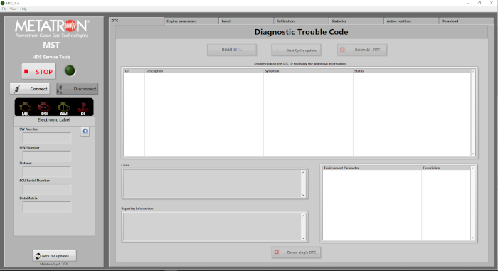
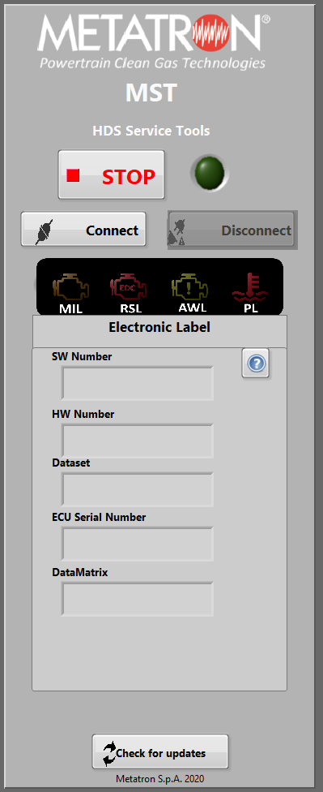

.. include:: <isonum.txt>
.. include:: ../_static/figures.txt
.. include:: ../_static/app/figures.txt

|mst_000|

.. _mst_manual:

METATRON SERVICE TOOL
=====================

Introduction
------------

MST stands for Metatron Service Tool and it is a tool for diagnostics of vehicles equipped with Engine Control Unit Metatron HDS.
MST communicates with the ECU trough :term:`UDS` protocol.

.. note:: MST version
    This appendix is written based on MST version 2.0.0.22. |mst_005|. Functions and information may change in future versions.

With MST you can:

    * Read the electronic label and update the fields dedicated to the customer

    * Check the status of the fault memory and delete it

    * Read the environmental conditions of the DTC

    * Read and delete the Adaptive Parameters

    * Check the status of the lamps

    * Manage the update of HDS Firmware (Boot/Application SW)

    * Read the engine parameters (RLI)

    * UHEGO free air automatic calibration procedure

    * Read the throttle learning calibration

    * Read the statistical data of the vehicle (Engine work time, refuel number, stechio A/F, power on counter, …)

HDS9 <-> MST connection layout
------------------------------

MST must interact with the diagnosis port of HDS, i.e. CAN 3.

Depending on the context, development, test bed or vehicle the connection can be established in one od the following example.

|mst_010|

In vehicle context the diagnosis line should be already fitted including the connection from other controllers. Can 3 of HDS must converge to the already present pins in the OBD socket.

|mst_020|

MST is a PC application that needs to be connected via USB to the CAN line. A special device take care of convert the CAN bus signals to USB. Metatron developed the MST application including in the installation package the driver of a very common, reliable and cost effective device coming from Peak producer. The most common and simple model is the `PCAN-USB p.n. IPEH-002021 <https://www.peak-system.com/PCAN-USB.199.0.html?&L=1>`_

|mst_030|

Installation
------------

Follow the step in following figures.

|mst_040|

|mst_050|

|mst_060|

|mst_070|

|mst_080|

Functions:
----------

The MST application windows is divided into two sections:

The main window, on the right, that includes many tabs dedicated to the specific functions, the status side bar on the left side. Following chapter will describe in details the function available in the different tabs or portion of windows.

The status sidebar
++++++++++++++++++

On the left of the main application window the Left status window shows the status of the connection and few parameters read from the :term`ECU` label.  It also contains the button for manage the connection.

* Press **Connect** button to start a connection. If the connection is established the led indicator start blinking. Electronic label of ECU is read and *SW number* , *HW number*, *Dataset+, *ECU serial number* and *Datamatrix* parameters are shown.

.. warning:: Last two parameters applies only when connecting a serial production ECU. Development ECU does not provide such parameters.

* Pressing the **Disconnect** button the MST connection to ECU is terminated.

* The red **STOP** button is used to stop the *LabView* runtime engine on which the MST application is built.

* The corresponding *Start* is on the top left part of the window as a transport arrow button. It only appears when the runtime engine is stopped.

* The malfunction indicators array includes the four most used (standard) indicators in the style of :term:`IC` display. The status is updated as soon as the connection starts and every 1 second.

    MIL
        Malfunction Indicator used to visualize the presence of Emission Related :term:`DTC`;

    RED LAMP
        Used to visualize the presence of high priority :term:`DTC` affecting performance and safety of engine;

    WARNING LAMP
        Or Yellow Lamp is used to visualize the presence of medium / low priority :term:`DTC` that may affect performance of engine;

    PL
        Protection Lamp - Only used to detect some engine most important parameters status out of normal conditions (e.g. Oil Pressure to Low or Engine Coolant too Hot). The warning light turned ON may not involve the storing of a DTC.

* At the bottom of the status window a button **Check for updates** allow user to detect the availability of a new release of MST.

.. warning:: The check for updates start automatically if the item in *View/Check for updates on start* on *View* menu id checked.
    |mst_100|
    The check can work only if the host is connected on the Metatron LAN. When the connection to the Metatron LAN is absent, delays in opening the application may occur due to waiting for the timeout. To avoid the annoying delay, it is recommended to enable the automatic search function for new releases only if you are connected to the Metatron LAN.

Operative panel - DTC tab
-------------------------

:term:`DTC` `From Wikipedia, the free encyclopedia  <https://en.wikipedia.org/wiki/On-board_diagnostics#OBD-II_Diagnostic_Trouble_Codes>`_

:term:`DTC`

.. TODO:
    Description of the MST functions when picture available from `Dalla Pria <mailto:daniele.dallapria@metatron.it>`_
