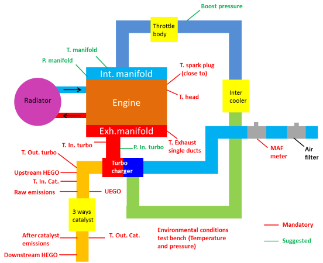

.. include:: <isonum.txt>
.. include:: ../_static/figures.txt
.. include:: ../_static/sys/figures.txt

|logo|

Engine Instrumentation & Development Tools
==========================================

Instrumentation
---------------

Recommended Engine Instrumentation
++++++++++++++++++++++++++++++++++

Before starting the calibration of a new engine on the test bench, it’s necessary to have a complete control of all engine system, from air intake to exhaust gas. In particular it’s mandatory to control the temperatures of the head engine and of turbine inlet and outlet in order to maintain them, during the calibration, lower than limits fixed for materials.
As engine instrumentation has to be customized for each application it’s not possible to give detailed instructions always valid.
For the calibration work a typical engine instrumentation is reported in FIGURE below:

    A scheme of the instrumentation

The functions and priority of single instrumentation are in table below

.. table:: Recommended instrumentation for HDS application development
    :widths: auto

    +--------------------------+--------------------------------------------+------------------------------+
    | Instrumentations         |    Functions                               |  Priority                    |
    +==========================+============================================+==============================+
    |  Mass air flow meter     |    to calibrate the speed density model    |  Mandatory                   |
    +--------------------------+--------------------------------------------+------------------------------+
    |  Cyl. Press. Sensors     |    monitoring combustion                   |  Mandatory at least one cyl. |
    +--------------------------+--------------------------------------------+------------------------------+
    |  UEGO sensor             |    to verify Air Fuel Ratio                |  Mandatory                   |
    +--------------------------+--------------------------------------------+------------------------------+
    |  T inlet turbocharger    |   to estimate turbocharger work,           |  Mandatory                   |
    +--------------------------+   material stress and                      +------------------------------+
    |  T outlet turbocharger   |   to improve efficiency during calibration |  Optional                    |
    +--------------------------+--------------------------------------------+------------------------------+
    |  T exhaust single ducts  |   monitor combustion balance among cyls.   |  Optional                    |
    +--------------------------+--------------------------------------------+------------------------------+
    |  T in / out catalyst     |    to verify catalyst efficiency           |  Optional                    |
    +--------------------------+--------------------------------------------+------------------------------+
    |  Environment conditions  |    to set the base parameters              |  Optional                    |
    +--------------------------+--------------------------------------------+------------------------------+

The fundamental instrumentation for calibrate HDS
+++++++++++++++++++++++++++++++++++++++++++++++++

We all know that the development of an engine application may require a huge amount of engineering efforts and this manual is not intended for explain how to do it. The instrumentation used may vary a lot depending on a lot of availabilities, requirements, personal approaches, environmental contexts, time to market, technological constraints, ....

**HDS application development strongly requires** few instrumentation to exploit properly the provided Engine Control System features. Following chapters will go through these items with an *how?, where?, when? and why?* approach, stating that the answer to *who?* question is simply *you*, the reader.

The Mass Air Flow measure
~~~~~~~~~~~~~~~~~~~~~~~~~

* *HOW?* An Air Flow sensor that can measure the Mass of Air intaked by the engine capable of provide the measure mainly in steady state. The accuracy of the measure is more relevant than the response time. The range may be the real problem since the amount of air may very of one order of magnitude. The best solution is to integrate and use a Hot Film MAF directly connected to the HDS. This solution also provides two helpful features:

    a. the measure will be available in the same context of the development tools (e.g. Canape or Inca)

    b. is possible to set (for development) the measured air instead of the estimated air for controlling the injection.

.. sidebar:: Hot-Film Air-Mass Meters
    :subtitle: A standard Automotive Mass Production Components

    |sys_020|

* *WHERE?* The sensor must be placed in order to include the air intaked by the engine. The most suitable position of the sensor is the air intake pipe after the filter before the compressor in case of Turbocharged engine or the intake manifold in case of normally aspirated engine.

* *WHEN?* The measure must be available during the calibration of the torque request, air demand and air measure functions. That represent the 80% of the base calibration.

* *WHY?* The torque management in Otto cycle engines is driven by means of air throttling. The HDS provides a complete set of functions for managing the intaked air for:

    * Requested Torque generation

    * Management of the injection

    * Ensure the safety of the Powertrain

    * Provide the diagnosis output in case of malfunctioning of components non covered by direct diagnosis

The Cylinder Pressure measure (CPS)
~~~~~~~~~~~~~~~~~~~~~~~~~~~~~~~~~~~

* *HOW?* Piezoelectric cylinder pressure sensors are the mainstream device for **indicating system**. Special tooling of the cylinder head as well as spark plug adaptors let to sense the combustion pressure while engine run.

.. sidebar:: Cylinder pressure sensor
    :subtitle: The standard reference is the piezoelectric cylinder pressure sensor supplied by Kistler®

    |sys_030|

* *WHERE?* Taking into account that engine may have unbalanced charge distribution or cooling efficiency among cylinder, the best way is to monitor all cylinders. Because of the not negligible cost of such sensors (taking into consideration also the critical tooling for installation) a good compromise may be to fit at least some symmetric section of the cylinder assembly. The minimum instrumentation is one cylinder in a medium position. See schematic figure below.

|sys_040|

* *WHEN?* The measure must be available during the calibration of the POWER CURVE, Spark Advance, Knocking Detection, EGR. In general for all calibration concerning the quality of the combustion (i,e, the ttarget Lambda in lean burn applications).

* *WHY?* The research of the optimal combustion is the key of many target of engine: fuel consumption, emissions, working temperature, heat balance , not speaking about mechanical design constraints (P max, Knocking index, etc..) all of them needs to monitor the combustion. How can you think to do it without CPS?

The Air Fuel Ratio measure (Lambda Meter)
~~~~~~~~~~~~~~~~~~~~~~~~~~~~~~~~~~~~~~~~~

.. sidebar:: Lambda Meter
    :subtitle: This is a standard package provided by `Motec <https://www.motec.com.au/>`_

    |sys_050|

* *HOW?* Wideband Oxygen Sensor with dedicated display or conditioning unit with analog or digital output. Other system like emission analysis may be suitable but they are at least much more complicated, expensive and less responsive.

* *WHERE?* The best place  for this sensor is the turbine outlet, very close to the similar sesnor used for HDS controller input.

* *WHEN?* Always.

* *WHY?* The research of the optimal combustion is the key of many target of engine: lambda is one ot the 2 keys of the combustion control.

The Development Applications
----------------------------

Engine Control Units like HDS exchange a lot of data with other peripherals. Among many possible communication channels and interfaced peripherals we describe in following chapters the only strongly needed for manage properly the Application Development.  We then briefly mention communication peripherals not strictly necessary but which, being available, could facilitate and speed up the work of the applicator.

The fundamental interactions of users with controllers are necessary for:

1. let the engine do what is requested (`Calibration`_);

2. understanding while it is not doing what is requested (`Diagnosis`_).

The optional communication channels, of course during the application development phase, could be used for:

3. Stimulate the torque request input of HDS

4. manage special equipment / instrumentation

5. manage smart devices included into sensors / actuators list

6. many others .........

Calibration
+++++++++++

The interaction with HDS :term:`ECU` for the purposes related to the engine calibration is fundamental. The third party PC based applications perform many tasks. Among them the most important are:

a. **Calibration Data Management** - *CDM* The Calibration Data can be edited both *live* (online) or *remote* (offline) using the formatting services of the application. I.e. a table with 2 dependencies is shown in a grid with X and Y break points aligned with columns and rows.

b. **Measures** - *Monitor* All the calculated parameters can be visualized into numerical windows as well as Oscilloscope types graph in function of time or any other assigned arbitrary parameter as X axis.

c. **Datalog** - *Logs* All the measures's data as per point b. can be recorded into file choosing an individual appropriate sample rate for later analysis.

d. **Data Analysis** - *Analysis* Data stored into files during task as per point c. can be viewed and post processed for inspect the behaviour of parameter calculation as well as to observe the controlled physical system (e.g. the turbocharger response in transient)

e. **ECU Memory Management** - *Flashing* The calibration data, Application SW, Boot FW can be modified with dedicated Flash Memory services

f. **Experiment Layout** or **Pages** - Mixed calibration and Measure windows can be arranged in single screens according to the customs needs. The Screen layouts can be saved, duplicated, modified for future reuses.

.. sidebar::  The communication protocol XCP (or) "Universal Measurement and Calibration Protocol
    :subtitle: The high performance protocol dedicated to calibration tasks

    The interaction of PC applications and HDS :term:`ECU` is established by means of a digital communication. The status of the art for HDS9 is the use of a CAN line (i.e. CAN#1 see :ref:`can_settings`) which implements the  `**XCP** <https://en.wikipedia.org/wiki/XCP_(protocol)>`_ protocol on CAN FD.

All these functions are commonly provided by suites like

ETAS `INCA <https://www.etas.com/en/products/inca.php>`_

    What?
        A ETAS `INCA license <https://www.etas.com/en/products/inca_software_products-ordering_information.php>`_ for INCA Base program `INCA installation <https://www.etas.com/en/downloadcenter/>`_.

        A ETAS CAN fd to usb interface. HDS has been verified to work properly with `ES 582 module <https://www.etas.com/en/products/es582_usb_can_fd_bus_interface.php>`_. Other ETAS devices operating with XCP on CANFD may be used but must be previously verified. Every device needs specific drivers that can be downloaded from the supplier download support center.

        A set of **project files** provided by Metatron that includes specifically for INCA:

        * HDS9 specific prof folder

        * HDS9 specific database folder

VECTOR `CANape <https://www.vector.com/int/en/products/products-a-z/software/canape/>`_

    What?
        A Vector `CANape license <https://www.vector.com/int/en/company/get-info/get-a-price-quotation/>`_ for CANape Base program `CANape installation <https://www.vector.com/int/en/products/products-a-z/software/canape/canape-history/#c114700>`_.

        A Vector CAN fd to usb interface. HDS has been verified to work properly and efficiently with `VN 1610 dongle <https://www.vector.com/int/en/products/products-a-z/hardware/network-interfaces/vn16xx/>`_. Other Vector devices operating with XCP on CANFD may be used but must be previously verified. Every device needs specific drivers that can be downloaded from the supplier download support center.

        A set of **project files** provided by Metatron that includes specifically for CANape:

        * HDS9 Canape specific .cna file and project structured folder

Both INCA and CANape uses the same :term:`ECU` symbol database conformed to ASAP specifications which file extension is A2L. Also uses same data encryption *SeedNKeyXcp.dll* DLL as well as *CRC32.fkv*

.. :note:: Supporting calibration program installation, configuration and usage.

    It is out of the scope of present manual to cover all the topics related to the installation, configuration and usage of the two above described Software programs. The supplier can offer the best support for all needs including training session, tutorial and help desks. Visit the specific Internet sites and look through the offers.

.. :note:: Other calibration development program

    It is possible to use for calibration other solution based on XCP on CAN FD. Metatron give warranty of correct working only for the two above referenced products.

Diagnosis
+++++++++

The very general term **diagnosis** refers in this context (interaction between a user and the powertrain) to the final task of the diagnosis functions: the publication of the status of the memory and the possibility to reset the error codes. Often is the way to answer to the question: *why it is not doing what I expect?*. All the possible interactions are structured in **diagnostic services**.

.. :sidebar:: UDS -Unified Diagnostic Services
    :subtitle: `From Wikipedia, the free encyclopedia <https://en.wikipedia.org/wiki/Unified_Diagnostic_Services>`_

    Unified Diagnostic Services (UDS) is a diagnostic communication protocol used in electronic control units (ECUs) within automotive electronics, which is specified in the ISO 14229-1. It is derived from ISO 14230-3 (KWP2000) and the now obsolete ISO 15765-3 (Diagnostic Communication over Controller Area Network (DoCAN)[2]). 'Unified' in this context means that it is an international and not a company-specific standard. By now this communication protocol is used in all new ECUs made by Tier 1 suppliers of Original Equipment Manufacturer (OEM), and is incorporated into other standards, such as AUTOSAR. The ECUs in modern vehicles control nearly all functions, including electronic fuel injection (EFI), engine control, the transmission, anti-lock braking system, door locks, braking, window operation, and more.

The HDS provide diagnostic services on CAN line (i.e. CAN#3 see :ref:`can_settings`) which implements the UDS protocol.

The most important area of use of the :term:`ECU` diagnosis system and related diagnostic services is that of post-sales assistance for vehicles. In this context, it plays a crucial role in reporting anomalies to the driver, to ensure adequate levels of safety for the driver himself and secondly for the vehicle, and in the repairability of the vehicle components. Vehicle manufacturer invest lot of resources in after sales services and all of them developed a custom diagnostic device capable of interact with all vehicle sold by the brand.

.. tip:: The :term:`OEM` custom scan tool communication development
    Unless the adoption of UDS protocol should ensure a high level of portability of HDS :term:`ECU` diagnostic services to different vehicle manufacturer's "diagnostic tools", when an engine application is candidate to :term:`SOP` schedule a specific task for verify the proper work of HDS with the target scan tool. Metatron may give the support for this task if the scan tool can be shipped to Metatron Labs with full set of user manual and communication specification. Testing session may also be performed directly on the OEM workshop. The test must be done on preseries vehicle.

For standard purposes but especially for HDS dedicated purposes Metatron developed a diagnostic tool called :term:`MST`. It is a PC based application that implements many different functions.

|sys_060|

The instruction manual covering installation, additional requires equipment, functions and uasge of MST is available in :ref:`mst_manual`.