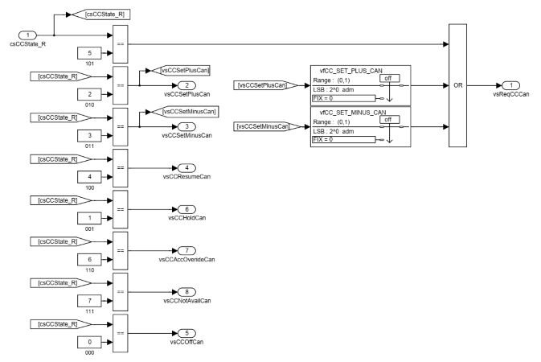
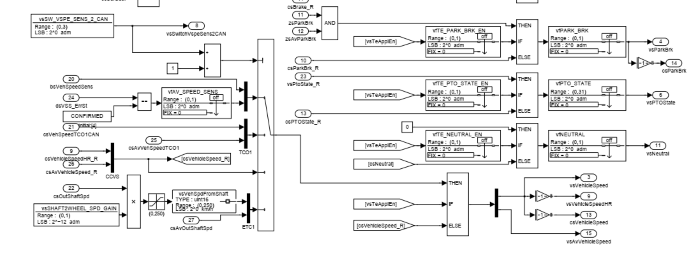
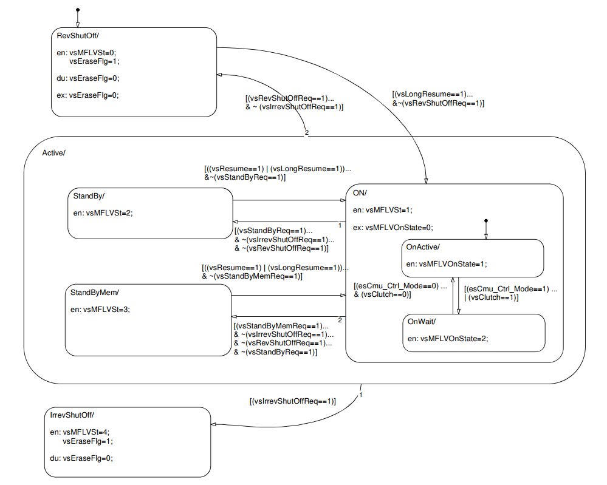

.. include:: <isonum.txt>
.. include:: ../_static/figures.txt
.. include:: ../_static/veh-fcn/figures.txt

|veh_010|

Vehicle functions
-----------------

In HDS the vehicle functions group provide a set of controls that interact with the ECM by means of inputs and / or actuator that are not mounted on the base engine itself. E.g. the starter motor, an auxiliary of the engine, may be required to be activated by the ECM. Other example is the Air Conditioning Compressor activation (often a clutch) that may be required to be activated by the ECM. More and more these set of function on a vehicle are placed in the range of controls of a :term:`VCM`.

Vehicle functions digital inputs
################################

Many vehicle function are activated and / or managed by means of special digital inputs. The digital inputs are activated applying a low level or high level voltage to some dedicated pins of the ECM.

.. note:: Refer to wiring harness schematic for the pin assignment.

The conditioning of digital inputs
^^^^^^^^^^^^^^^^^^^^^^^^^^^^^^^^^^

All the digital inputs follows the conditioning process as described in present chapter:

    0. **HW selectable Pull-up / Pull-down** some digital input provide a selector for pull-up / pull-down electrical signal conditioning. The general syntax of calibration symbol is :guilabel:`bsPULLN_XXXXXXX_ID`. E.g. for Air conditioning request button the selector is :guilabel:`bsPULL10_AirCondReq_ID`. Calibrating to 1 the pull-up is inserted, calibrating to 0 the pull-down is inserted.

    1. **input digital status** that can be 0 or 1 depending from the voltage applied to the specific pin - the symbol is a ``bsXXXXXXXXXX`` (e.g. ``bsKeyEngStart`` for request of starter activation).

    2. **signal debouncing** take care of avoiding intermittent unwanted sequence of activation / deactivation due for example to the bouncing of an electrical contact or intermittent finger push on a button. Is a digital filtering with a constant in calibration that represents the number of counted sample at same level of the input to allow the commutation from one status to the other. The calibration can be set from 0 to 255 so realizing a debouncing for 4 ms task till of more than 1 second.

    .. warning::

        The debouncing introduce a delay from the input trigger to the output response proportional to the calibration of the number of sample. E.g. setting to 50 the debouncing filter constant for a digital input means to accept a delay of 50 * 4 = 200 ms from the instant when the button is pressed till the first reaction of the ECM.

    E.g. the debouncing filter constant for ``bsKeyEngStart`` is :guilabel:`zsKEY_START_DEB_STEP` . The output symbol from the debouncing filter is `zsKeyStartDeb` not present in the ECM database of symbols.

    3. **selectable inversion (Digital Negation DN)** to make the input flexible in the way that for any kind of logical electrical setup connected to the input pin is possible to have a resulting status active or inactive to be propagated to the functions that needs the input, a selectable logical negation can be applied. The calibration selector is :guilabel:`zsDN_XXXXXXXXX` (for our example :guilabel:`zsDN_KEY_ENG_START` ) . The output is the final symbol of the digital input status is ``zsKeyEngStart``. The truth table of this feature, using always the ``bsKeyEngStart`` , is the following:

    .. _truth_table_digital_inversion:
    .. list-table:: Digital inversion Truth Table
       :widths: 30 30 30
       :header-rows: 1

       * - ``bsKeyEngStart``
         - :guilabel:`zsDN_KEY_ENG_START`
         - ``zsKeyEngStart``
       * - F (0) 
         - F (0)
         - F (0)
       * - T (1)
         - F (0)
         - T (1)
       * - F (0)
         - T (1)
         - T (1)
       * - T (1)
         - T (1)
         - F (0)

    4. **fixing the output** The value of the output of the digital input conditioning can be fixed to a constant value independent from the input status. For doing this operation is present the calibration fix :guilabel:`zfXXXXXXX` ( :guilabel:`zfKEY_ENG_START`, divided into :guilabel:`zfKEY_ENG_START_Enable` to activate or deactivate the fixed value set in :guilabel:`zfKEY_ENG_START_Value` in our recurrent example).

    5. **the digital input general ENABLE** This calibration flag propagate to the strategies that may be activated by the digital input the real availability or not of the input. In other words, if the application configuration provide the managing of the digital input it must be defined as *available* (value 1), whether if nothing is connected to the pin and we don't want to have ECM reactions for any kind of status can be detected, it must be defined as *NOT available* (value 0). The general calibration symbol for this configuration calibration is :guilabel:`zsAV_XXXXXXXXXX`  ( :guilabel:`zsAV_KEY_ENG_START` in our example).

Following list is the complete set of digital inputs used for vehicle functions:

.. _digital_inputs_list:
.. list-table:: List of digital inputs
   :widths: 20 20 20 20 20 20 20
   :header-rows: 1

   * - Input
     - Debouncing constant
     - DN selector
     - FIX
     - Output
     - DI Available flag
     - Pull-up selector
   * - ``bsAirCondReq``
     - :guilabel:`zsAIR_COND_DEB_STEP`
     - :guilabel:`zsDN_AIR_CND_REQ`
     - :guilabel:`zfAIR_CND_REQ`
     - ``zsAirCondReq``
     - :guilabel:`zsAV_AIR_CND_REQ`
     - :guilabel:`bsPULL10_AirCondReq_ID`
   * - ``bsStartAccDecCbt``
     - :guilabel:`zsSTART_CBT_DEB_STEP`
     - :guilabel:`zsDN_START_CBT`
     - :guilabel:`zfSTART_CBT`
     - ``zsStartAccDecCbt``
     - :guilabel:`zsAV_START_CBT`
     - :guilabel:`bsPULL8_StartAuxReq_ID`
   * - ``bsStopCbt``
     - :guilabel:`zsSTOP_CBT_DEB_STEP`
     - :guilabel:`zsDN_STOP_CBT`
     - :guilabel:`zfSTOP_CBT`
     - ``zsStopCbt``
     - :guilabel:`zsAV_STOP_CBT`
     - :guilabel:`bsPULL9_StopAuxReq_ID`
   * - ``bsKey``
     - :guilabel:`zsKEY_DEB_STEP`
     - :guilabel:`zsDN_KEY`
     - :guilabel:`zfKEY`
     - ``zsKey``
     - :guilabel:`zsAV_KEY`
     - :guilabel:`N.A.`
   * - ``bsIdleAcc``
     - :guilabel:`zsIDLE_DEB_STEP`
     - :guilabel:`zsDN_IDLE_ACC`
     - :guilabel:`zfIDLE_ACC`
     - ``zsIdleAcc``
     - :guilabel:`zsAV_IDLE_ACC`
     - :guilabel:`bsPULL0_AccIdleSw_ID`
   * - ``bsDoorsOpen``
     - :guilabel:`zsDOORS_OP_DEB_STEP`
     - :guilabel:`zsDN_DOORS_OPEN`
     - :guilabel:`zfDOORS_OPEN`
     - ``zsDoorsOpen``
     - :guilabel:`zsAV_DOORS_OPEN`
     - :guilabel:`bsPULL5_EngBrk_DoorSw_ID`
   * - ``bsVehSpeedLim``
     - :guilabel:`zsSPEED_LIM_DEB_STEP`
     - :guilabel:`zsDN_VEH_SPEED_LIM`
     - :guilabel:`zfVEH_SPEED_LIM`
     - ``zsVehSpeedLim``
     - :guilabel:`zsAV_VEH_SPEED_LIM`
     - :guilabel:`N.A.`
   * - ``bsClutch``
     - :guilabel:`zsCLUTCH_DEB_STEP`
     - :guilabel:`zsDN_CLUTCH`
     - :guilabel:`zfCLUTCH`
     - ``zsClutch``
     - :guilabel:`zsAV_CLUTCH`
     - :guilabel:`bsPULL4_ClutchPedSw_ID`
   * - ``bsResume``
     - :guilabel:`zsRESUME_DEB_STEP`
     - :guilabel:`zsDN_RESUME`
     - :guilabel:`zfRESUME_ON`
     - ``zsResumeOn``
     - :guilabel:`zsAV_RESUME`
     - :guilabel:`bsPULL11_DigIn1_MflvOn_ID`
   * - ``bsKeyEngStart``
     - :guilabel:`zsKEY_START_DEB_STEP`
     - :guilabel:`zsDN_KEY_ENG_START`
     - :guilabel:`zfKEY_ENG_START`
     - ``zsKeyEngStart``
     - :guilabel:`zsAV_KEY_ENG_START`
     - :guilabel:`N.A.`
   * - ``bsBrakePed1``
     - :guilabel:`zsBRK_PD1_DEB_STEP`
     - :guilabel:`zsDN_BRAKE_PED1`
     - :guilabel:`zfBRAKE_PED1`
     - ``zsBrakePed1``
     - :guilabel:`zsAV_BRAKE_PED1`
     - :guilabel:`bsPULL2_BrakePedSw1_ID`
   * - ``bsBrakePed2``
     - :guilabel:`zsBRK_PD2_DEB_STEP`
     - :guilabel:`zsDN_BRAKE_PED2`
     - :guilabel:`zfBRAKE_PED2`
     - ``zsBrakePed2``
     - :guilabel:`zsAV_BRAKE_PED2`
     - :guilabel:`bsPULL3_BrakePedSw2_ID`
   * - ``bsParkBrk``
     - :guilabel:`zsPRK_BRK_DEB_STEP`
     - :guilabel:`zsDN_PARK_BRK`
     - :guilabel:`zfPARK_BRK`
     - ``zsParkBrk``
     - :guilabel:`zsAV_PARK_BRK`
     - :guilabel:`bsPULL7_ParkBrk_LimSw_ID`
   * - ``bsNIdleAcc``
     - :guilabel:`zsIDLE_DEB_STEP`
     - :guilabel:`zsDN_NIDLE_ACC`
     - :guilabel:`zfNIDLE_ACC`
     - ``zsNIdleAcc``
     - :guilabel:`zsAV_NIDLE_ACC`
     - :guilabel:`bsPULL0_AccIdleSw_ID`
   * - ``bsNIdleAcc``
     - :guilabel:`zsIDLE_DEB_STEP`
     - :guilabel:`zsDN_KICK_DOWN`
     - :guilabel:`zfKICK_DOWN`
     - ``zsKickDown``
     - :guilabel:`zsAV_KICK_DOWN`
     - :guilabel:`bsPULL0_AccIdleSw_ID`
   * - ``bsOff``
     - :guilabel:`zsOFF_DEB_STEP`
     - :guilabel:`zsDN_OFF`
     - :guilabel:`zfOFF`
     - ``zsOff``
     - :guilabel:`zsAV_OFF`
     - :guilabel:`bsPULL12_DigIn2_MflvOff_ID`
   * - ``bsSetPlus``
     - :guilabel:`zsPLUS_DEB_STEP`
     - :guilabel:`zsDN_SET_PLUS`
     - :guilabel:`zfSET_PLUS`
     - ``zsSetPlus``
     - :guilabel:`zsAV_SET_PLUS`
     - :guilabel:`bsPULL13_DigIn3_MflvP_ID`
   * - ``bsSetMinus``
     - :guilabel:`zsMINUS_DEB_STEP`
     - :guilabel:`zsDN_SET_MINUS`
     - :guilabel:`zfSET_MINUS`
     - ``zsSetMinus``
     - :guilabel:`zsAV_SET_MINUS`
     - :guilabel:`bsPULL14_DigIn4_MflvM_ID`
   * - ``bsBKLRequest``
     - :guilabel:`zsBKL_REQ_DEB_STEP`
     - :guilabel:`zsDN_BKL_REQUEST`
     - :guilabel:`zfBKL_REQUEST`
     - ``zsBKLRequest``
     - :guilabel:`zsAV_BKL_REQUEST`
     - :guilabel:`N.A.`

.. warning::

    The table above table `digital_inputs_list`_ shows the standard Dgital Input configuration. Different version of HDS SW may have different configuration of Digital Input connection to functions.

.. *******************************************************************************************************************
.. *                                                                                                                 *
.. *                                                                                                                 *
.. *   VEHICLE FUNCTION PTO AND CRUISE CONTROL                                                                       *
.. *                                                                                                                 *
.. *                                                                                                                 *
.. *******************************************************************************************************************

The Cruise Control (CC) and Power Take-Off (PTO) functions
##########################################################

Cruise Control Function
^^^^^^^^^^^^^^^^^^^^^^^

History
~~~~~~~

Speed control was used in automobiles as early as 1900 in the Wilson-Pilcher and also in the 1910s by Peerless. Peerless advertised that their system would "maintain speed whether up hill or down". The technology was adopted by James Watt and Matthew Boulton in 1788 to control steam engines, but the use of governors dates at least back to the 17th century.

.. sidebar:: The standard interface.

    The standard interface for CC of PTO is made with 4 buttons:

    | Cc-pto_010|

    1. Resume - Init - Start

    2. Stop - Canc

    3. Set Plus - Increase

    4. Set Minus - Decrease

On an engine the governor adjusts the throttle position as the speed of the engine changes with different loads, so as to maintain a near constant speed.
Modern cruise control (also known as a speedostat or tempomat) was invented in 1948 by the inventor and mechanical engineer Ralph Teetor. His idea was ostensibly borne out of the frustration of riding in a car driven by his lawyer, who kept speeding up and slowing down as he talked. More significant factor in developing this device was the 35 mph (56 km/h) speed limit imposed across the US during World War II to save on gasoline use and reduce tire wear. A mechanism controlled by the driver provided resistance to further pressure on the accelerator pedal when the vehicle reaching the desired speed. Teetor's idea of a dashboard speed selector with a mechanism connected to the drive shaft and a device able to push against the gas pedal was patented in 1950. He added a speed lock capability that would maintain the car's speed until the driver tapped the brake pedal or turned off the system.
The first car with Teetor's "Speedostat" system was the 1958 Imperial (called "Auto-pilot") using a speed dial on the dashboard.[3] This system calculated ground speed based on driveshaft rotations off the rotating speedometer-cable, and used a bi-directional screw-drive electric motor to vary throttle position as needed. It was Cadillac Division that re-named the "Speedostat" and marketed the device as "Cruise Control."

Operation
~~~~~~~~~

The driver must bring the vehicle up to speed manually and use a button to set the cruise control to the current speed.  The cruise control takes its speed signal from a rotating driveshaft, speedometer cable, wheel speed sensor from the engine's RPM, or from internal speed pulses produced electronically by the vehicle. Most systems do not allow the use of the cruise control below a certain speed - typically around 25 mph (40 km/h).
On the latest vehicles fitted with electronic throttle control, cruise control can be easily integrated into the vehicle's engine management system. Modern "adaptive" systems (see below) include the ability to automatically reduce speed when the distance to a car in front, or the speed limit, decreases. This is an advantage for those driving in unfamiliar areas.

The cruise control systems of some vehicles incorporate a "speed limiter" function, which will not allow the vehicle to accelerate beyond a pre-set maximum; this can usually be overridden by fully depressing the accelerator pedal. (Most systems will prevent the vehicle accelerating beyond the chosen speed, but will not apply the brakes in the event of overspeeding downhill.)
On vehicles with a manual transmission, cruise control is less flexible because the act of depressing the clutch pedal and shifting gears usually disengages the cruise control. The "resume" feature has to be used each time after selecting the new gear and releasing the clutch. Therefore, cruise control is of most benefit at motorway/highway speeds when top gear is used virtually all the time.

Power take-off (PTO)
^^^^^^^^^^^^^^^^^^^^

A power take-off or power takeoff (PTO) is any of several methods for taking power from a power source, such as a running engine, and transmitting it to an application such as an attached implement or separate machines.  Most commonly, it is a splined drive shaft installed on a tractor or truck allowing implements with mating fittings to be powered directly by the engine.
Semi-permanently mounted power take-offs can also be found on industrial and marine engines. These applications typically use a drive shaft and bolted joint to transmit power to a secondary implement or accessory. In the case of a marine application, such shafts may be used to power fire pumps.
Truck transmissions have one or more locations which allow for a PTO to be mounted. The PTO must be purchased separately and care is required to match the physical interface of the transmission with a compatible PTO. PTO suppliers will usually require details of the make, model and even serial number of the transmission. Care is also needed to ensure that the physical space around the transmission allows for installation of the PTO. The PTO is engaged/disengaged using the main transmission clutch and a remote control mechanism which operates on the PTO itself. Typically an air valve is used to engage the PTO, but a mechanical linkage, electric or hydraulic mechanism are also options.
Units will be rated according to the continuous and intermittent torque that can be applied through them and different models will offer different "PTO shaft rotation to engine RPM" ratios.
In the majority of cases, the PTO will connect directly to a hydraulic pump. This allows for transmission of mechanical force through the hydraulic fluid system to any location around the vehicle where a hydraulic motor will convert it back into rotary or linear mechanical force. 
Typical applications include:

    * Running a water pump on a fire engine or water truck

    * Running a truck mounted hot water extraction machine for carpet cleaning (driving vacuum blower and high-pressure solution pumps)

    * Powering a blower system used to move dry materials such as cement

    * Powering a vehicle-integrated air compressor system

    * Raising a dump truck bed

    * Operating the mechanical arm on a bucket truck used by electrical maintenance personnel or Cable TV maintenance crews

    * Operating a winch on a tow truck

    * Operating the compactor on a garbage truck

    * Operating a Boom/Grapple truck

    * Operating a truck mounted tree spade and lift-mast assembly

HDS9 “Speed control”
^^^^^^^^^^^^^^^^^^^^

HDS9 can manage the closed loop control of  “Speeds” target. The general term of speed is due to the fact that is possible both to control the engine speed and vehicle speed at a defined user (driver) target. The control architecture for these control function is common since the strategy function is to internally control the torque request in order to keep the desired engine speed at the target value.

The general architecture and configuration
^^^^^^^^^^^^^^^^^^^^^^^^^^^^^^^^^^^^^^^^^^

Human Interface Commands – Driver Interface
~~~~~~~~~~~~~~~~~~~~~~~~~~~~~~~~~~~~~~~~~~~

The vehicles that provide the Cruise Control (CC) and/or Power Take-Off (PTO) are fitted with a set of buttons or levers for interacting with the activation/deactivation and setting of the functions.

The minimum set of commands for managing CC and PTO in HDS9 includes:

    * Resume command (set) – activate / reactivate the CC or PTO at current speed

    * Off command (canc) – deactivate CC or PTO

    * Set Plus (+) – modifies the target of the active function adding one step or ramping up

    * Set Minus (-) – modifies the target of the active function reducing one step or ramping down

Additional mandatory commands:
~~~~~~~~~~~~~~~~~~~~~~~~~~~~~~

    * Clutch pressed (clutch disengaged) switch signal – mandatory for CC - Safety : the torque generated by engine must be balanced by the braking torque of vehicle and the transmission ratio must be kept constant

    * Brake pressed switch signal – Mandatory for CC – Safety: the function must be switched off if the driver press the brake

    * Vehicle speed  – mandatory for CC

Additional optional signals:
~~~~~~~~~~~~~~~~~~~~~~~~~~~~

    * Gear engaged and or Actual Gear ratio – for CC can add more controlling features to the function

HDS CC and PTO commands interfaces
^^^^^^^^^^^^^^^^^^^^^^^^^^^^^^^^^^

The HDS9 ECU provides two different interfaces for receive the CC and/or PTO commands.

The CAN 2 channel over the J1939
~~~~~~~~~~~~~~~~~~~~~~~~~~~~~~~~

The CAN 2 channel over the J1939 standard protocol using many messages, is the most developed interface since the full CAN messages implementation makes available a big set of signals coming from many different controllers (VCM, BodyComputer, Gearbox, Dashboard ….). Following Table i is the essential implementation for CAN interface:

.. table:: CAN 2 CC-PTO commands interface

    +----------------+---------------+------------+-------------------------+--------------------------------+
    | Signal         | CAN message   | Timing     | HDS symbol              | Note                           |
    +================+===============+============+=========================+================================+
    | CC state       | CCVS          | 100 ms     | ``csCCState_R``         | See picture `CC state`_        |
    +----------------+---------------+------------+-------------------------+--------------------------------+
    | Brake pressed  | CCVS          | 100 ms     | ``bsBrakeCAN``          |                                |
    +----------------+---------------+------------+-------------------------+--------------------------------+
    | Clutch pressed | CCVS          | 100 ms     | ``bsClutchCAN``         |                                |
    +----------------+---------------+------------+-------------------------+--------------------------------+
    | Selected gear  | CCVS          | 100 ms     | ``bsSlctdGearCAN``      | For the optional signal        |
    |                |               |            +-------------------------+                                |
    |                |               |            | ``bsCurrentGearCAN``    |  Gear_engaged                  |
    +----------------+---------------+------------+-------------------------+--------------------------------+
    | Vehicle speed  | TC01          | 100 ms     | ``csVehSpeedTCO1CAN``   | See picture `Vehicle speed`_   |
    |                +---------------+            +-------------------------+                                |
    |                | CCVS          |            | ``bsVehSpeedCAN``       |                                |
    +----------------+---------------+------------+-------------------------+--------------------------------+

    _`CC state`

    _`Vehicle speed`

ECU Wired Digital Input
~~~~~~~~~~~~~~~~~~~~~~~

The inputs can be configured electrically and logically in order to accept a variety of connections implementation. See `The conditioning of digital inputs`_ and :ref:`List of digital inputs <digital_inputs_list>` for details.

.. warning::

    The HDS pinout for connecting the relevant Digital Inputs is available on the schematic drawing dedicated to each application. Refer to that document for wiring harness design.

Interface mode selection (CAN and/or Dig. Input)
^^^^^^^^^^^^^^^^^^^^^^^^^^^^^^^^^^^^^^^^^^^^^^^^

Both CC and PTO can be individually configured for use CAN commands or wired Digital Inputs.

.. tip::

    In picture `CC PTO Interface mode selectors`_  it is clearly shown as the two calibration flags :guilabel:`vsCC_DIG_EN` and :guilabel:`vsPTO_DIG_EN` let to configure independently CC and PTO for working with Digital Inputs (if calibration is set to 1) or CAN messages (if calibration is set to 0).

    .. figure:: ../_static/veh-fcn/cc-pto_040.png
        :width: 648
        :height: 450
        :align: center
        :alt: Interface mode selection scheme
        :figclass: align-center
        :target: ../_static/veh-fcn/cc-pto_040_full.png

        _`CC PTO Interface mode selectors`

Selective Cruise Control or Power Take-Off activation
^^^^^^^^^^^^^^^^^^^^^^^^^^^^^^^^^^^^^^^^^^^^^^^^^^^^^

The same set of commands operates both speed controls CC and PTO. The choice whether a command will activate the CC or the PTO is based on the vehicle speed.

.. tip::

    In the lower side of  picture `CC PTO Interface mode selectors`_   is possible to see the selection logic. The controlled variable ``vsSpeedCCRange``. When is set to 0 none PTO and CC are available, when set to 1 PTO is available, when set to 2 CC is available.
    The calibrations to use for setting the operating choice logic are:

    .. table:: PTO vs CC selection

        +----------------------------------+----------------------------+-------------------------+
        | Calibration symbol               | Suggested value            | Note                    |
        +----------------------------------+----------------------------+-------------------------+
        | :guilabel:`vsMIN_VEH_SPEED4PTO`  | 10 [km/h]                  | See note 1              |
        +----------------------------------+----------------------------+-------------------------+
        | :guilabel:`vsMAX_VEH_SPEED4PTO`  | 15 km/h                    | See note 2              |
        +----------------------------------+----------------------------+-------------------------+
        | :guilabel:`vsDELTA_VEH_SPEED4CC` | 5 km/h                     | See note 3              |
        +----------------------------------+----------------------------+-------------------------+
        | :guilabel:`vsMAX_VEH_SPEED4CC`   | 90 km/h                    | sEE NOTE 4              |
        +----------------------------------+----------------------------+-------------------------+

    * *note 1* - Despite the name is really the maximum speed at which the PTO is enabled

    * *note 2* - Real maximum speed to allow the enabling of PTO. The value is  than overridden by previous :guilabel:`vsMIN_VEH_SPEED4PTO`

    * *note 3* - The value to be added to :guilabel:`sMAX_VEH_SPEED4PTO` to instantiate an hysteresis from where the CC is activated above and remain active below the range

    * *note 4* - Above this value CC is no more available

    .. figure:: ../_static/veh-fcn/cc-pto_050.png
        :width: 676
        :height: 676
        :align: center
        :alt: PTO vs CC selection example
        :figclass: align-center

        _`CC or PTO selection based on Vehicle Speed`

Operation of CC and PTO
^^^^^^^^^^^^^^^^^^^^^^^

The operations of these functions are quite well known.  In HDS9 control logic there are many possibility to configure the behaviour of CC and PTO.
Four main concepts must be clear:

    * The CC or PTO is active when the OFF command is not active and the RESUME pulse command is sent to controller. 

    * The active CC or PTO can move to STAND_BY if some conditions are verified.  As soon as the conditions are no more verified the active status can be resumed. The boolean flag of request to go to STAND_BY status is ``vsStandByReq`` .

    * The active CC or PTO can move to REVERSIBLE_SHUT_OFF if some conditions are verified. The reversible shut off means that in the same trip, if the condition are no more verified the active state can be reset and restart.  The boolean flag of request to go to REVERSIBLE_SHUT_OFF status is ``vsRevShutOffReq`` .

    * The active CC or PTO can move to IRREVERSIBLE_SHUT_OFF if some conditions are verified. The irreversible shutoff means that the engine must stopped and the whole system reset for enabling CC and PTO to be reactivated. The boolean flag of request to go to IRREVERSIBLE_SHUT_OFF status is ``vsIrrevShutOffReq`` .

The set of checked conditions is the same for all status changes but they can be enabled by means of six different enabling bitmask calibrations (three for CC and three for PTO).

.. tip::

    The conditions are arranged in several 16 bits *bitmasks* that operates in boolean logic against the below described condition. The following table resumes the 3 x 2 bitmasks (3 for each PTO and CC).

    .. table:: Bitmasks for CC and PTO

        +----------------------------------+---------------------------------------------------+-------+
        | Bitmask symbol                   | Bitmask function                                  | Value |
        +----------------------------------+---------------------------------------------------+-------+
        | :guilabel:`CC_STDBY_REQ_COND`    | Bitmask for trigger standby for CC                | x4BC4 |
        +----------------------------------+---------------------------------------------------+-------+
        | :guilabel:`CC_SHTOFF_REV_COND`   | Bitmask for trigger reversible shutoff  for CC    | x2008 |
        +----------------------------------+---------------------------------------------------+-------+
        | :guilabel:`CC_SHTOFF_IRREV_C`    | Bitmask for trigger irreversible shutoff  for CC  | x0001 |
        +----------------------------------+---------------------------------------------------+-------+
        | :guilabel:`PTO_STDBY_REQ_COND`   | Bitmask for trigger standby for PTO               | x0842 |
        +----------------------------------+---------------------------------------------------+-------+
        | :guilabel:`PTO_SHTOFF_REV_COND`  | Bitmask for trigger reversible shutoff  for PTO   | x0000 |
        +----------------------------------+---------------------------------------------------+-------+
        | :guilabel:`PTO_SHTOFF_IRREV_C`   | Bitmask for trigger irreversible shutoff  for CC  | x0000 |
        +----------------------------------+---------------------------------------------------+-------+

    .. warning::

        The values in the above table are only *suggested value*. Each application needs the development of the dedicated calibration.

    .. note::

        The operating bitmask can be selectively initialized based on the status of ``vsCCActive``. **IF** ``vsCCActive`` is True(1) **THEN** The bitMask is initialized with CC_xxxxxxxx calibrations ( :guilabel:`CC_STDBY_REQ_COND` , :guilabel:`CC_SHTOFF_REV_COND` and  :guilabel:`CC_SHTOFF_IRREV_C` ) **OTHERWISE** with  PTO_xxxxxxxx calibrations ( :guilabel:`PTO_STDBY_REQ_COND` , :guilabel:`PTO_SHTOFF_REV_COND` and :guilabel:`PTO_SHTOFF_IRREV_C` )

The conditions for activate – deactivate CC and PTO
^^^^^^^^^^^^^^^^^^^^^^^^^^^^^^^^^^^^^^^^^^^^^^^^^^^

In following chapters is possible described the logic for all conditions numbered from 0 to 15.

.. sidebar:: The BITMASK example

    The picture shows how the bitwise operation of conditions ``vsCondx`` against the calibration Bitmasks is implemented. The example shows the ``vsStandByReq``.

        .. figure:: ../_static/veh-fcn/cc-pto_060.png
            :width: 176
            :height: 445
            :align: center
            :alt: Bitmask operation example
            :figclass: align-center

            _`Bitmask operation example`

Following chapters will go through details for each condition. The used logic is the bitwise AND operation with the corresponding bitmask in calibration.

The 16 conditions (from 0 to 15) can be monitored by means of ``vsCondx`` symbols where x may be from 0 to 15. E.g. the condition number 11 can be monitored by means of ``vsCond11`` symbol. The detection og each condition runs every 4 ms.

vsCond0 – Recovery dsR41 Irreversible shutoff
~~~~~~~~~~~~~~~~~~~~~~~~~~~~~~~~~~~~~~~~~~~~~

.. table::

    +---------------------------------------------------------------------------------------------------------------+
    | ``vsCond0`` condition position in the Bitmasks and numerical weight [hexadecimal]                             |
    +-------------+------+------+------+------+------+------+------+------+------+------+------+------+-------------+
    | <---- lsb   |      |      |      |      |      |      |      |      |      |      |      |      |    msb ---> |
    +------+------+------+------+------+------+------+------+------+------+------+------+------+------+------+------+
    | 0001 |      |      |      |      |      |      |      |      |      |      |      |      |      |      |      |
    +------+------+------+------+------+------+------+------+------+------+------+------+------+------+------+------+

.. tip::

    This condition is the connection of any possible diagnostic fault with the PTO or CC management. For example if we want to disable the PTO in case of fault on coolant temperature sensor, the **dsR41** must be activates in the *GSEC* calibration of the coolant temperature diagnosis. When the **dsR41** will be activated the condition is detected by ``vsCond0`` and if the bit is calibrated to true for any of the bitmask, the proper action will be applied to CC and/or PTO.

vsCond1 and vsCond2 – Vehicle speed ranges
~~~~~~~~~~~~~~~~~~~~~~~~~~~~~~~~~~~~~~~~~~

.. table::

    +---------------------------------------------------------------------------------------------------------------+
    | ``vsCond1`` condition position in the Bitmasks and numerical weight [hexadecimal]                             |
    +-------------+------+------+------+------+------+------+------+------+------+------+------+------+-------------+
    | <---- lsb   |      |      |      |      |      |      |      |      |      |      |      |      |    msb ---> |
    +------+------+------+------+------+------+------+------+------+------+------+------+------+------+------+------+
    |      | 0002 |      |      |      |      |      |      |      |      |      |      |      |      |      |      |
    +------+------+------+------+------+------+------+------+------+------+------+------+------+------+------+------+

.. table::

    +---------------------------------------------------------------------------------------------------------------+
    | ``vsCond2`` condition position in the Bitmasks and numerical weight [hexadecimal]                             |
    +-------------+------+------+------+------+------+------+------+------+------+------+------+------+-------------+
    | <---- lsb   |      |      |      |      |      |      |      |      |      |      |      |      |    msb ---> |
    +------+------+------+------+------+------+------+------+------+------+------+------+------+------+------+------+
    |      |      | 0004 |      |      |      |      |      |      |      |      |      |      |      |      |      |
    +------+------+------+------+------+------+------+------+------+------+------+------+------+------+------+------+

This conditions can be used in order to add some more controlled behaviour of CC or PTO based on the vsSpeedCCRange already depicted in `Selective Cruise Control or Power Take-Off activation`_ .

.. tip::

    For ``vsCond1``:

    **IF** ``vsSpeedCCRange``  == 2 **THEN** ``vsCond1`` = 1 **OTHERWISE** ``vsCond1`` = 0

    For ``vsCond2``:

    **IF** ``vsSpeedCCRange``  == 1 **THEN** ``vsCond2`` = 1 **OTHERWISE** ``vsCond2`` = 0

vsCond3 – Engine speed range conditions
~~~~~~~~~~~~~~~~~~~~~~~~~~~~~~~~~~~~~~~

.. table::

    +---------------------------------------------------------------------------------------------------------------+
    | ``vsCond3`` condition position in the Bitmasks and numerical weight [hexadecimal]                             |
    +-------------+------+------+------+------+------+------+------+------+------+------+------+------+-------------+
    | <---- lsb   |      |      |      |      |      |      |      |      |      |      |      |      |    msb ---> |
    +------+------+------+------+------+------+------+------+------+------+------+------+------+------+------+------+
    |      |      |      | 0008 |      |      |      |      |      |      |      |      |      |      |      |      |
    +------+------+------+------+------+------+------+------+------+------+------+------+------+------+------+------+

Used for conditioning PTO and CC functions on the engine speed operating range.

.. tip::

        ``vsCond3`` is True(1) :

        if is exceeded the time in calibration :guilabel:`vsMAX_4RPM_OUT_RANGE` [s] with engine speed ``bsRPM`` out of the range between a minimum value :guilabel:`vsRPM_SHOFF_DOWN` and a maximum value :guilabel:`vsRPM_SHOFF_UP`.

vsCond4 – Engine speed error permanent
~~~~~~~~~~~~~~~~~~~~~~~~~~~~~~~~~~~~~~

.. table::

    +---------------------------------------------------------------------------------------------------------------+
    | ``vsCond4`` condition position in the Bitmasks and numerical weight [hexadecimal]                             |
    +-------------+------+------+------+------+------+------+------+------+------+------+------+------+-------------+
    | <---- lsb   |      |      |      |      |      |      |      |      |      |      |      |      |    msb ---> |
    +------+------+------+------+------+------+------+------+------+------+------+------+------+------+------+------+
    |      |      |      |      | 0010 |      |      |      |      |      |      |      |      |      |      |      |
    +------+------+------+------+------+------+------+------+------+------+------+------+------+------+------+------+

This condition is used to trap long time with error of engine speed above a calibration threshold.

.. tip::

    ``vsCond4`` is True(1) :

    if is exceeded the time in calibration :guilabel:`vsMAX_TIME_4PTO_ERR` [s] with

    .. math:: \small ( {\lvert Error_{PTO} \rvert} > vsMAX\_PTO\_ERROR ) AND ( vsPtoActive ==  1)

    where

    * :math: \small Error_{PTO}  = {\lvert {bsRPM - vsPtoObjOld } \rvert}

    * :guilabel:`vsMAX_PTO_ERROR` is the maximum allowed long time error for PTO function

vsCond5 – Vehicle speed error permanent
~~~~~~~~~~~~~~~~~~~~~~~~~~~~~~~~~~~~~~~

.. table::

    +---------------------------------------------------------------------------------------------------------------+
    | ``vsCond5`` condition position in the Bitmasks and numerical weight [hexadecimal]                             |
    +-------------+------+------+------+------+------+------+------+------+------+------+------+------+-------------+
    | <---- lsb   |      |      |      |      |      |      |      |      |      |      |      |      |    msb ---> |
    +------+------+------+------+------+------+------+------+------+------+------+------+------+------+------+------+
    |      |      |      |      |      | 0020 |      |      |      |      |      |      |      |      |      |      |
    +------+------+------+------+------+------+------+------+------+------+------+------+------+------+------+------+

This condition is used to trap long time with error of vehicle speed above a calibration threshold. This condition operates like vsCond4 but check vehicle speed error instead of engine speed.

.. tip::

    ``vsCond5`` is True(1) :

    if is exceeded the time in calibration :guilabel:`vsMAX_TIME_4CC_ERR` [s] with

    .. math:: \small ( {\lvert Error_{CC} \rvert} > vsMAX\_CC\_ERROR ) AND ( vsCCActive ==  1)

    where

    * :math: \small Error_{CC}  = {\lvert {csVehicleSpeed - vsCCSpeedObjOld } \rvert}

    * :guilabel:`vsMAX_CC_ERROR` is the maximum allowed long time error for CC function

vsCond6 – Brake active deceleration
~~~~~~~~~~~~~~~~~~~~~~~~~~~~~~~~~~~

.. table::

    +---------------------------------------------------------------------------------------------------------------+
    | ``vsCond6`` condition position in the Bitmasks and numerical weight [hexadecimal]                             |
    +-------------+------+------+------+------+------+------+------+------+------+------+------+------+-------------+
    | <---- lsb   |      |      |      |      |      |      |      |      |      |      |      |      |    msb ---> |
    +------+------+------+------+------+------+------+------+------+------+------+------+------+------+------+------+
    |      |      |      |      |      |      | 0040 |      |      |      |      |      |      |      |      |      |
    +------+------+------+------+------+------+------+------+------+------+------+------+------+------+------+------+

This condition is used to trap a vehicle speed maximum error that occurs when the brake is active

.. tip::

    ``vsCond6`` is True(1) :

    if is verified

    .. math:: \small ( {Error_{CC} } <= vs\_CC_DELTA\_OBJ ) AND ( vsBrake ==  1)

    where

    * :math: \small Error_{CC}  = {csVehicleSpeed - vsCCSpeedObjOld }

    * :guilabel:`vs_CC_DELTA_OBJ` is the maximum allowed vehicle speed variation in brake condition to not disable the CC.

    .. note::

        The above condition :math:`\small ( {Error_{CC} } <= vs\_CC_DELTA\_OBJ )` can be fixed with  fix :guilabel:`vfVEH_COND_4BRAKE_SHOFF` symbol. Fixing to 1, always true, as soon as the ``vsBrake`` is arisen the ``vsCond6`` become True(1).

vsCond7 – Park Brake active detection
~~~~~~~~~~~~~~~~~~~~~~~~~~~~~~~~~~~~~

.. table::

    +---------------------------------------------------------------------------------------------------------------+
    | ``vsCond7`` condition position in the Bitmasks and numerical weight [hexadecimal]                             |
    +-------------+------+------+------+------+------+------+------+------+------+------+------+------+-------------+
    | <---- lsb   |      |      |      |      |      |      |      |      |      |      |      |      |    msb ---> |
    +------+------+------+------+------+------+------+------+------+------+------+------+------+------+------+------+
    |      |      |      |      |      |      |      | 0080 |      |      |      |      |      |      |      |      |
    +------+------+------+------+------+------+------+------+------+------+------+------+------+------+------+------+

This condition is used to trap the inserted park brake. Can be used to allow the PTO only if the park brake is inserted.

.. tip::

    ``vsCond7`` is True(1) :

    if is verified

    **IF** ``vsParkBrk`` is True(1)

    **OR**

    ( ``csCruiseAct_R`` is False(0) **AND** ``vsPtoActive`` is True(1) )

    where

    *  ``csCruiseAct_R`` is the Cruise control switch from CCVS CAN Rx (1 = on, 0 = off)

    * ``vsPtoActive`` is the flaf of active status of PTO

vsCond8 – Strong deceleration
~~~~~~~~~~~~~~~~~~~~~~~~~~~~~

.. table::

    +---------------------------------------------------------------------------------------------------------------+
    | ``vsCond8`` condition position in the Bitmasks and numerical weight [hexadecimal]                             |
    +-------------+------+------+------+------+------+------+------+------+------+------+------+------+-------------+
    | <---- lsb   |      |      |      |      |      |      |      |      |      |      |      |      |    msb ---> |
    +------+------+------+------+------+------+------+------+------+------+------+------+------+------+------+------+
    |      |      |      |      |      |      |      |      | 0100 |      |      |      |      |      |      |      |
    +------+------+------+------+------+------+------+------+------+------+------+------+------+------+------+------+

This condition trigger a sensible deceleration active for a minimum time.

.. tip::

    **IF** ``vsDer_VehSpd_100ms`` (the 100 [ms] derivative of ``vsVehicleSpeedHR`` ) is **>=** :guilabel:`vsMAX_DECEL` **THEN** a timer is incremented. ``vsCond8`` become True(1) if the timer reach or exceed the value of :guilabel:`vsTIME_DECEL` [s].

vsCond9 and vsCond10 – Calculated gear ratio out of limits
~~~~~~~~~~~~~~~~~~~~~~~~~~~~~~~~~~~~~~~~~~~~~~~~~~~~~~~~~~

.. table::

    +---------------------------------------------------------------------------------------------------------------+
    | ``vsCond9`` condition position in the Bitmasks and numerical weight [hexadecimal]                             |
    +-------------+------+------+------+------+------+------+------+------+------+------+------+------+-------------+
    | <---- lsb   |      |      |      |      |      |      |      |      |      |      |      |      |    msb ---> |
    +------+------+------+------+------+------+------+------+------+------+------+------+------+------+------+------+
    |      |      |      |      |      |      |      |      |      | 0200 |      |      |      |      |      |      |
    +------+------+------+------+------+------+------+------+------+------+------+------+------+------+------+------+

.. table::

    +---------------------------------------------------------------------------------------------------------------+
    | ``vsCond10`` condition position in the Bitmasks and numerical weight [hexadecimal]                            |
    +-------------+------+------+------+------+------+------+------+------+------+------+------+------+-------------+
    | <---- lsb   |      |      |      |      |      |      |      |      |      |      |      |      |    msb ---> |
    +------+------+------+------+------+------+------+------+------+------+------+------+------+------+------+------+
    |      |      |      |      |      |      |      |      |      |      | 0400 |      |      |      |      |      |
    +------+------+------+------+------+------+------+------+------+------+------+------+------+------+------+------+

Both conditions can be used to detect anomalous gear ratio above or below two limits.

``vsRatioSpdRpm`` is calculated as

.. math::  \small vsRatioSpdRpm = \frac {csVehicleSpeed} {bsRPM}

.. tip::  ``vsCond9`` **Gear Ratio too low** calibration

    **IF** ``vsRatioSpdRpm`` is **<=** :guilabel:`vsRATIO_TOO_LOW` for :guilabel:`vsTIME_RATIO_WRONG` [s] time **THEN** ``vsCond9`` is True(1).

.. tip::  ``vsCond10`` **Gear Ratio too high** calibration

    **IF** ``vsRatioSpdRpm`` is **>** :guilabel:`vsRATIO_TOO_HIGH` for :guilabel:`vsTIME_RATIO_WRONG` [s] time **THEN** ``vsCond10`` is True(1).

vsCond11 – Clutch pressed
~~~~~~~~~~~~~~~~~~~~~~~~~

.. table::

    +---------------------------------------------------------------------------------------------------------------+
    | ``vsCond11`` condition position in the Bitmasks and numerical weight [hexadecimal]                            |
    +-------------+------+------+------+------+------+------+------+------+------+------+------+------+-------------+
    | <---- lsb   |      |      |      |      |      |      |      |      |      |      |      |      |    msb ---> |
    +------+------+------+------+------+------+------+------+------+------+------+------+------+------+------+------+
    |      |      |      |      |      |      |      |      |      |      |      | 0800 |      |      |      |      |
    +------+------+------+------+------+------+------+------+------+------+------+------+------+------+------+------+

This condition detect the clutch pedal pressed.

.. tip::  ``vsCond11`` **Clutch pressed** calibration

    **IF** ``vsClutch`` is True(1) for :guilabel:`vsCLUTCH_MAX` [s] time **THEN** ``vsCond11`` is True(1).

vsCond12 – Gear Coupled
~~~~~~~~~~~~~~~~~~~~~~~

.. table::

    +---------------------------------------------------------------------------------------------------------------+
    | ``vsCond12`` condition position in the Bitmasks and numerical weight [hexadecimal]                            |
    +-------------+------+------+------+------+------+------+------+------+------+------+------+------+-------------+
    | <---- lsb   |      |      |      |      |      |      |      |      |      |      |      |      |    msb ---> |
    +------+------+------+------+------+------+------+------+------+------+------+------+------+------+------+------+
    |      |      |      |      |      |      |      |      |      |      |      |      | 1000 |      |      |      |
    +------+------+------+------+------+------+------+------+------+------+------+------+------+------+------+------+

Detect the Gear Coupled. Mainly used to disable the PTO in some application where the PTO must be enabled only if the gear is not coupled.

.. TODO: vsGearCoupled, csGearCoupled, vfGEAR_COUPLED management explanation

.. tip::  ``vsCond12`` **Gear engaged** calibration

    **IF** ``csGearCoupled`` is True(1) **THEN** ``vsCond12`` is True(1). ``vsGearCoup`` is set = to ``vsCond12`` and can be fixed by :guilabel:`vfGEAR_COUP` fix symbol.

vsCond13 – Recovery dsR09 present
~~~~~~~~~~~~~~~~~~~~~~~~~~~~~~~~~

.. table::

    +---------------------------------------------------------------------------------------------------------------+
    | ``vsCond13`` condition position in the Bitmasks and numerical weight [hexadecimal]                            |
    +-------------+------+------+------+------+------+------+------+------+------+------+------+------+-------------+
    | <---- lsb   |      |      |      |      |      |      |      |      |      |      |      |      |    msb ---> |
    +------+------+------+------+------+------+------+------+------+------+------+------+------+------+------+------+
    |      |      |      |      |      |      |      |      |      |      |      |      |      | 2000 |      |      |
    +------+------+------+------+------+------+------+------+------+------+------+------+------+------+------+------+

As per already depicted in `vsCond0 – Recovery dsR41 Irreversible shutoff`_ , this ``vsCond13`` line is for dsR09 who is for reversible shutoff.

.. tip::

    ``vsCond13`` works and can be calibrated as per `vsCond0 – Recovery dsR41 Irreversible shutoff`_ explanation.

vsCond14 – Too long time in active wait
~~~~~~~~~~~~~~~~~~~~~~~~~~~~~~~~~~~~~~~

.. table::

    +---------------------------------------------------------------------------------------------------------------+
    | ``vsCond14`` condition position in the Bitmasks and numerical weight [hexadecimal]                            |
    +-------------+------+------+------+------+------+------+------+------+------+------+------+------+-------------+
    | <---- lsb   |      |      |      |      |      |      |      |      |      |      |      |      |    msb ---> |
    +------+------+------+------+------+------+------+------+------+------+------+------+------+------+------+------+
    |      |      |      |      |      |      |      |      |      |      |      |      |      |      | 4000 |      |
    +------+------+------+------+------+------+------+------+------+------+------+------+------+------+------+------+

This condition monitor an internal status of PTO or CC, i.e. *Active Wait* status. If this condition remains for some very long time, is possible to move the status to reversible shutoff.

The *Active Wait* status is True(1) **IF** ``vsMFLVOnState`` **==** 2.

.. tip::  ``vsCond14`` **Active Wait too long** calibration

    **IF** *ActiveWait* is True(1) for :guilabel:`vsMAX_TIME_4ACC` [s] time **THEN** ``vsCond14`` is True(1).

vsCond15 – Unused
~~~~~~~~~~~~~~~~~

This condition has been provided but is not connected to any real signal. Cannot be verified because is blocked to inactive by SW rigid setting.

Setting the targets for CC or PTO
^^^^^^^^^^^^^^^^^^^^^^^^^^^^^^^^^

Setting the target for CC
~~~~~~~~~~~~~~~~~~~~~~~~~

The CC control is based on the vehicle speed signal. The target is set initially at the current speed of the vehicle when the CC become active. After that, it can be increased or decreased operating on the Set Plus or Set Minus buttons.

.. tip::
    The step plus and minus can be calibrated by means of respectively :guilabel:`vsSTEP_PLUS_CC` and :guilabel:`vsSTEP_MINUS_CC` when a step action on the button is detected, i.e. when ``vsPlusStep`` and ``vsMinusStep`` are active.

    The ramp ratio plus and minus can be calibrated by means of respectively :guilabel:`vsRAMP_PLUS_CC` and :guilabel:`vsRAMP_MINUS_CC` when a ramp action on the button is detected, i.e. when vsPlusRamp and vsMinusRamp are active.  The ramp’s step is applied every 4 ms but the calibration set the amount of target speed variation in 1 s.

    The calibrations :guilabel:`vfLIM_CC_OBJ_SUP` and :guilabel:`vfLIM_CC_OBJ_INF` are respectively the highest and lowest value of speed that is allowed to set with plus and minus operations. They take place of other limits already set respectively ``sVehSpeedLim`` and ``vsMaxVehSpeed4Pto`` .

    After the action of increase/decrease a filter is applied with a time constant :guilabel:`vsCC_SPD_OBJ_GRAD` in rpm/s. The same time constant is applied to both positive and negative steps.

.. note::

    By means of the ratio between engine speed ``bsRPM`` and vehicle speed ``csVehicleSpeed`` the target ``vsCCSpeedObj`` [km/h] is converted in ``vsCCObj`` [rpm]. So the control will follow always an engine speed target.

    .. math:: \small vsCCObj  [rpm] = \frac {( vsCCSpeedObj [km/h] *  bsRPM [rpm] ) } { csVehicleSpeed [km/h]}

Setting the target for PTO
~~~~~~~~~~~~~~~~~~~~~~~~~~

.. tip::

    The engine speed target of PTO function may be set in similar way like CC but starting when PTO become active from a default value in calibration :guilabel:`vsRPM_SET1_PTO` . After that, it can be increased or decreased operating on the Set Plus or Set Minus buttons.

    The step plus and minus can be calibrated by means of respectively :guilabel:`vsSTEP_PLUS_PTO` and :guilabel:`vsSTEP_MINUS_PTO` when a step action on the button is detected, i.e. when ``vsPlusStep`` and ``vsMinusStep`` are active.

    The ramp ratio plus and minus can be calibrated by means of respectively :guilabel:`vsRAMP_PLUS_PTO` and :guilabel:`vsRAMP_MINUS_PTO` when a ramp action on the button is detected, i.e. when `vsPlusRamp` and `vsMinusRamp` are active.  The ramp’s step is applied every 4 ms so the calibration set the amount of engine speed target variation in 1 s.

    Some calibration of fixed values of selectable engine speed target are available.

    .. list-table:: selectable PTO speeds calibration
        :header-rows: 1
        :widths: 35, 35, 35, 35

        * - Calibration
          - Av. on CAN 
          - Av. on DI
          - Activation signal
        * - :guilabel:`vsRPM_SET1_PTO`
          - Yes
          - Yes
          - ``vsPtoActive``
        * - :guilabel:`vsRPM_SET1_PTO`
          - Yes
          - NO
          - ``vsSet1Can``
        * - :guilabel:`vsRPM_SET2_PTO`
          - Yes
          - NO
          - ``vsSet2Can``
        * - :guilabel:`vsRPM_SET3_PTO`
          - Yes
          - NO
          - ``vsSet3Can``
        * - :guilabel:`vsRPM_SET4_PTO`
          - Yes
          - NO
          - ``vsSet4Can``

The buttons PLUS and MINUS actions
^^^^^^^^^^^^^^^^^^^^^^^^^^^^^^^^^^

The action of the button step or ramp is defined based on press time logic.
The logic is same for CC and PTO and follow the rule that a relatively short time activate a step variation and pressing for a longer time than the one needed to activate the step a ramp is activated. Common elements are the pressed button and command signal associated, the time to wait for activate the step, the added time needed to detect the ramp activation and the output signal.

.. tip::

    The calibration are limited to select the times for activate the corresponding output signal. In table below are shown the elements:

    .. list-table:: Setplus and setminus actions calibrations
        :header-rows: 1
        :widths: 35, 35, 35, 35

        * - Input signal
          - Time to STEP
          - Time to RAMP
          - Activated signal
        * - ``vsMFLVSetPlus``
          - :guilabel:`vsWAIT_PTO_SET_PLUS`
          - NA
          - ``vsPlusStep``
        * - ``vsMFLVSetPlus``
          - :guilabel:`vsWAIT_PTO_SET_PLUS`
          - \+ :guilabel:`vsWAIT_PTO_RAMP_PLUS`
          - ``vsPlusRamp``
        * - ``vsMFLVSetMinus``
          - :guilabel:`vsMFLVSetMinus`
          - NA
          - ``vsMinusStep``
        * - ``vsMFLVSetMinus``
          - :guilabel:`vsMFLVSetMinus`
          - \+ :guilabel:`vsWAIT_PTO_RAMP_MINUS`
          - ``vsMinusRamp``

    In short, to activate a step, e.g. for PLUS, only the :guilabel:`vsWAIT_PTO_SET_PLUS` is needed as wait time before trigger the ``vsMFLVSetPlus`` signal. To activate the ramp the total wait time is :guilabel:`vsWAIT_PTO_SET_PLUS` + :guilabel:`vsWAIT_PTO_RAMP_PLUS`.  or vsWAIT_PTO_SET_MINUS + vsWAIT_PTO_RAMP_MINUS time the

The internal status of CC or PTO functions
^^^^^^^^^^^^^^^^^^^^^^^^^^^^^^^^^^^^^^^^^^

The internal status of the CC or PTO is managed by a Finite State Machine ( :term:`FSM` ) described in BlockScheme of figure `CC PTO status FSM`_ below. The buttons/CAN inputs and the result of the ``vsCondx`` give the triggers for transition among all possible states. The state variable is ``vsMFLVSt``. In case of ``vsMFLVSt`` ==1 (Active) a nested FSM with controlled ``vsMFLVOnState`` manages the *OnActive* and *OnWait* Status for gear shifting (clutch pressed for short time).

    _`CC PTO status FSM`

.. warning::

    The picture `CC PTO status FSM`_ is given for reference and short description. The full text descritpion for FSM can be extremely repeating and requires lot of words and conditional test explicits. Use it for understanding the control logic. The implementation of this CC and PTO FSM is subjected to a strictly SAFETY design principle.

The control of engine/vehicle speed
^^^^^^^^^^^^^^^^^^^^^^^^^^^^^^^^^^^

The unified engine speed target (PTO/CC/TSC1)
~~~~~~~~~~~~~~~~~~~~~~~~~~~~~~~~~~~~~~~~~~~~~

As already said in `Setting the target for CC`_ the CC vehicle speed target is converted in an engine speed target similar to PTO target. The targets are then unified into one general target according to a priority logic. Other requests of engine speed control can come from different sources with different requests of target speeds. All requests are unified into one unique target including PTO / CC or request coming from CAN TSC1 message. Finally the real requested speed to be controlled as target is ``vsSpeedReqVCM_R`` that become ``vsSpeedReqVCM``.
 
The speed control - The general scheme of the controller
~~~~~~~~~~~~~~~~~~~~~~~~~~~~~~~~~~~~~~~~~~~~~~~~~~~~~~~~

The general scheme of the controller is a full featured PID control with some Open Loop terms that can be calibrated according to some engine / load user characteristics.

    * The target PID subsystem provides many target filtering/smoothing functions and some arbitrate among contradictory requests. The most important output is the error speed to be compensated by following controller.

    * The PID section that includes the three contributes:

        * Proportional correction

        * Integrative correction

        * Derivative correction

    * Downstream the total closed loop gain can be refined for some static and dynamic parameters referring to inertias, viscosity of the engine+user system (e.g. the actual gear engaged)

    * Finally the contribution of the closed loop is merged with the open loop terms   
 
PID Target filtering
~~~~~~~~~~~~~~~~~~~~

The most important section of this module is the way for filtering the error to be compensated by the PID. Is possible to configure different filtering approach that may also keep into account the external torque request when exceed the speed controller demand. It depends on the specific application to use the most fitting method.   Other calibrations present in the module can help during the calibration job especially on the vehicle context.

The input for the filters is the :math:`\small Input_{new}` : **IF** ``esTorqWinsAgainstSpd`` is True(1) **THEN** the target is set equal to ``bsRPM`` **OTHERWISE** the target is  ``vsSpeedReqVCM``. In other words if the engine speed controller is not fully enabled the target of engine speed is set equal to the engine speed itself. If the engine speed controller is fully enabled the target of engine speed is set equal  ``vsSpeedReqVCM``.

**The output** of the filters is ``esSpdReqVCMFiltT`` and the PID will start to compensate the requested torque in order to reach this last value.

.. tip::

    The filtering mode can be choose by means of the selector :guilabel:`esEN_N_OBJ_FILTR` calibration symbol.

    0. :guilabel:`esEN_N_OBJ_FILTR` == 0 - **NO FILTERING**

    1. :guilabel:`esEN_N_OBJ_FILTR` == 1 - **Low Pass FILTERING**

    2. :guilabel:`esEN_N_OBJ_FILTR` == 2 - **FILTERING and FORCING**

**Low Pass Filter**
+++++++++++++++++++

.. tip::

    Input :math:`\small Input_{new}` : **IF** ``esTorqWinsAgainstSpd`` is True(1) **THEN** the target is set equal to ``bsRPM`` **OTHERWISE** the target is  ``vsSpeedReqVCM``.

    Output :math:`\small Output_{new}` : ``esRPM1_rif_dinam``

    LPF filter constant :math:`\small K_{filter}` : :guilabel:`esK_LPF_RIF_PID_N` operating according following implementation:

        .. math::
            \small Output_{new} =  Input_{new} * K_{filter} + Output_{old} * (1 - K_{filter})

    The first order LPF provide a simple way to smooth the target variation especially when the PTO starts working and engine must move from any position to the target. It can be selected with esEN_N_OBJ_FILTR calibration set to 1 (while 0 is no filtering).

**Dynamic and Forced Filter**
+++++++++++++++++++++++++++++

This filtering submodule offers a more detailed way to filter the target depending on the sign of the error. It can be selected with :guilabel:`esEN_N_OBJ_FILTR` calibration symbol set to 2.

.. tip::

    Inputs:

        * :math:`\small Input_{new}` : **IF** ``esTorqWinsAgainstSpd`` is True(1) **THEN** the target is set equal to ``bsRPM`` **OTHERWISE** the target is  ``vsSpeedReqVCM``.

        * ``bsRPM``

        * ``esEnSpeedCtrlPID``

        * ``esTorqWinsAgainstSpd``

        * ``vsSpeedReqVCM``

    Output :math:`\small Output_{new}` : ``esRpmObDynForced``

    Calibrations:

        * :guilabel:`esSTEP_OVERTARGET`

        * :guilabel:`esSTEP_UNDERTARGET`

    **Briefly** , depending from different trigger for initialization when engine speed control start working, the engine speed target will move from an initial value set equal to current engine speed  ``bsRPM`` to the Final Value target with a number of steps applied every 4 [ms] defined in calibration with :guilabel:`esSTEP_OVERTARGET` and :guilabel:`esSTEP_UNDERTARGET` calibration symbols used respectively in case the actual engine speed is above or below the final target.

    Hereby the description of the filtering function.

    |cc-pto_080|

    **The active filter operates as following:**

        .. math::
            \small Output_{new} = esRpmErrLimF + Input_{new}

        where:

        * :math:`\small Output_{new}` : ``esRpmObDynForced``

        * ``esRpmErrLimF`` is calculated as:

            .. math::
                \small esRpmErrLimF = esErrCntLim * ( bsRPM_{init} - Input_{new} )

            where:

            * ``esErrCntLim`` is calculated as follows:

                **IF** ``esEnSpeedCtrlPID`` is False(0) **THEN** ``esErrCntLim`` = 0 **OTHERWISE** is the normalized value of a ratio between a number of steps value coming from calibration and a counter initialized at same calibration value and unitary decremented till 0 every 4 [ms]. The tansfer function is following:

                .. math::

                    \small esErrCntLim_n = \frac { Step_{n-1} - 1  } {CalibratedStepsTotalNumber}

                where:

                * :math:`\small Step_0 = CalibratedStepsTotalNumber` by initialization and consequently due to unitary decrement after :math:`\small CalibratedStepsTotalNumber` of 4 [ms] ticks we get :math:`\small Step_{CalibratedStepsTotalNumber} = 0`.

                *  :math:`\small CalibratedStepsTotalNumber` is :

                    * :guilabel:`esSTEP_OVERTARGET` **IF** ``bsRPM`` **>**  :math:`\small Input_{new}` (the target)

                    * :guilabel:`esSTEP_UNDERTARGET` **IF** ``bsRPM`` **<=**  :math:`\small Input_{new}` (the target)

            * :math:`\small bsRPM_{init}` is the latched value of ``bsRPM`` when the flag ``esTrigObjFilForced`` become True(1)

                where:

                * ``esTrigObjFilForced`` become True(1) **IF**  ( ``esEnSpeedCtrlPID`` become True(1) ) **OR** ( ``esTorqWinsAgainstSpd`` become False(0) ) **OR** ( value of ``vsSpeedReqVCM`` change )

            * :math:`\small Input_{new}` : **IF** ``esTorqWinsAgainstSpd`` is True(1) **THEN** the target is set equal to ``bsRPM`` **OTHERWISE** the target is  ``vsSpeedReqVCM``.

The PID controller
~~~~~~~~~~~~~~~~~~

The PID controller operates in order to minimize the value of ``esSpeed_ErrorTst`` calculated as  ``esSpdReqVCMFiltT`` - ``bsRPM``, both in positive and negative range. **IF** ``esEnSpeedCtrlPID`` is False(0) ``esSpeed_ErrorTst`` is set to 0.

The total controller gain in percentage of (available) torque is ``esSpeed_Req_Per`` that comes from a complex calculation. Hereby the explanation of the several articulated contributions of the engine speed controller.

The final calculation is **IF** ``esEnSpeedCtrlPID`` is True(1) **THEN** ``esSpeed_Req_Per`` = ``esSpeed_Req_Perc_CL`` + ``esSpeed_Req_Perc_OL`` **ELSE**  ``esSpeed_Req_Per`` = 0

The total closed loop term ``esSpeed_Req_Perc_CL``
++++++++++++++++++++++++++++++++++++++++++++++++++

``esSpeed_Req_Perc_CL`` is the total closed loop control contribute for engine speed control. It can be fixed by means of :guilabel:`efPID_SPEED_CL` fix calibration symbol. It is calculated as follows:

    .. math::

        \small esSpeed\_Req\_Perc\_CL\ =\ esSpd2PerCmeTst\ *\ esSysGainSpeedCtrl

        \text{where:}

        \small esSpd2PerCmeTst\ =\ esKp\_Speed\_Perc\ +\ esKi\_SpeedCPerc\ +\ esKd_SpeedCPerc

        \text{and}

        \small \pmb{IF}\ vsGearCoupled\ ==\ 1

        \small \pmb{THEN}\ esSysGainSpeedCtrl\ =\ esSysGainCToil\ *\ esSysGainGearc

        \small \pmb{ELSE}\ esSysGainSpeedCtrl\ =\ esSysGainCToil\ *\ 1

.. tip::

    * ``esKp_Speed_Perc`` is explained in `KP , proportional gain`_ chapter.

    * ``esKi_SpeedCPerc`` is ``esKiSpeedPerc`` explained in `Ki, integral gain`_ chapter.

    * ``esKd_SpeedCPerc`` is ``esKdSpeedPercTst`` explained in `Kd, derivative gain`_ chapter.

    * ``vsGearCoupled`` is a VCM CAN signal that can be fixed if not available by means of :guilabel:`vfGEAR_COUPLED` fix calibration symbol.

    * ``esSysGainGearc`` is interpolated from :guilabel:`evSYS_GAIN_GEARC` range 0 - 10 [adm] f(``vsActGear``). ``vsActGear`` is the number of the gear actually engaged coming from a VCM CAN message.

    * ``esSysGainCToil`` is interpolated from :guilabel:`evSYS_GAIN_C_TOIL` range 0 - 10 [adm] f(``zsTOil``).

.. note::

    **General recommendation for controller calibration**

    The PID should be used with a PI only configuration, leaving the Derivative term at the end only for solving strong overshoots or underscores.

    The PI must be identified both for CC and PTO.

    If the inertia switch is available (i.e. is known the gear ratio or the PTO configuration), it must be identified for all inertia at two extreme load, no load and full load).

    On a standard vehicle application with CC and one PTO mode only the identification points are 4.

    If the current gear coupled is known than is better to split the CC specific calibration among low and high gear ratios.

    The Ziegler–Nichols method can be used effectively to find the right calibration of KP and KI.

KP , proportional gain
++++++++++++++++++++++

The Proportional term of PID controller for engine speed is calculated when ``esEnSpeedCtrlPID`` flag is True(1). The output of the Kp calculation is ``esKpSpeedPercTst``.

.. tip::

    ``esKpSpeedPercTst`` is calculated as

    .. math::

        \small esKpSpeedPercTst = esKpGaininertia * KpCoefficient

    where:

    * :math:`\small esKpGaininertia` = ``esKpGaininertia`` range 0 to 10 [adm]. Is the interpolated value from :guilabel:`evKP_GAININERTIA` table f(``esSpeedCtrlStiffness``). The ``esSpeedCtrlStiffness`` is a parameters coming from CAN related to the PTO modes managed by :term:`VCM`. It must be set to 1 when this management is not available. It can be forced to 1 using the  :guilabel:`cfINT_GOV` fix calibration symbol set to ENABLE value 0. This can be considered as the base Kp term to be used both mode CC and PTO.

    * :math:`\small KpCoefficient` is a term that depends from the status of ``vsCCActive`` as follows:

        * when ``vsCCActive`` is True(1) (CC is active) :math:`\small KpCoefficient` = ``esKpCc`` interpolated value from :guilabel:`evKP_CC` table f(``esSpeed_ErrorTst``). It an additional gain scheduled term to be used to modulate the PID response depending on the distance within actual speed and target. Its range is from 0 to 2 [ :math:`\small \frac {\%}{rpm}` ]. Neutral to 1,  can be multiplying or dividing, in order to have authority in both direction faster and slower response.

        * when ``vsCCActive`` is False(0) (PTO is active) :math:`\small KpCoefficient` = ``esKpspeedCtrl`` interpolated value from :guilabel:`etKPSPEED_CTRL` table f(``esSpeed_ErrorTst``, ``vsSpeedReqVCM`` ). It an additional gain scheduled term to be used to modulate the PID response depending on the distance within actual speed and target and also from the target itself. Its range is from 0 to 1.9531 [ :math:`\small \frac {\%}{rpm}` ]. Neutral to 1,  can be multiplying or dividing, in order to have authority in both direction faster and slower response.

Ki, integral gain
+++++++++++++++++

The Integral term of PID controller for engine speed is calculated every 4 [ms] when ``esEnSpeedCtrlPID`` flag is True(1) since at least 2 x 4 ms [ticks] . The output of the Ki calculation is ``esKiSpeedPerc``.

The integral term has the same tables as the proportional described in `KP , proportional gain`_ for the calibration of the gain.  Another important section is the dead band and saturations of the contribute that is important for the well known problem of high integration correction slowly discharged when moving among different working points.

.. tip::

    The value of ``esKiSpeedPerc`` is calculated as following:

    .. math::

        \small esKiSpeedPerc_n =\overline{\underline{\text{limited}( KiPerc_{old} + Ki_{calibration})}_{min}}^{max}

    where:

    * :math:`Ki_{calibration}` is the gain in calibration that is set = 0 in case ``esTorqWinsAgainstSpd`` is True(1) or follows the following calculation:

        .. math::

            \small Ki_{calibration} = ( esKiGaininertia * KiCoefficient)

        where:

        * :math:`\small esKiGaininertia` = ``esKiGaininertia`` range 0 to 10 [adm]. Is the interpolated value from :guilabel:`evKI_GAININERTIA` table f(``esSpeedCtrlStiffness``). The ``esSpeedCtrlStiffness`` is a parameters coming from CAN related to the PTO modes managed by :term:`VCM`. It must be set to 1 when this management is not available. It can be forced to 1 using the  :guilabel:`cfINT_GOV` fix calibration symbol set to ENABLE value 0. This can be considered as the base Kp term to be used both mode CC and PTO.

        * :math:`\small KiCoefficient` is a term that depends from the status of ``vsCCActive`` as follows:

            * when ``vsCCActive`` is True(1) (CC is active) :math:`\small KiCoefficient` = ``esKiCc`` interpolated value from :guilabel:`evKI_CC` table f(``esSpeed_ErrorTst``). It an additional gain scheduled term to be used to modulate the PID response depending on the distance within actual speed and target. Its range is from 0 to 1.9531 [ :math:`\small \frac {\%}{rpm}` ]. Neutral to 1,  can be multiplying or dividing, in order to have authority in both direction faster and slower response.

            * when ``vsCCActive`` is False(0) (PTO is active) :math:`\small KiCoefficient` = ``esKispeedCtrl`` interpolated value from :guilabel:`etKISPEED_CTRL` table f(``esSpeed_ErrorTst``, ``vsSpeedReqVCM`` ). It an additional gain scheduled term to be used to modulate the PID response depending on the distance within actual speed and target and also from the target itself. Its range is from 0 to 1.9531 [ :math:`\small \frac {\%}{rpm}` ]. Neutral to 1,  can be multiplying or dividing, in order to have authority in both direction faster and slower response.

    * :math:`KiPerc_{old}` is calculated as:

        * **IF** ``esTorqWinsAgainstSpd`` == True(1) **THEN**

            .. math::

                \small KiPerc_{old} = esPercCmuIstAbsReal - esSpeed\_Req\_Perc\_OL

            where:

            * :math:`\small esPercCmuIstAbsReal` = ``esPercCmuIstAbsReal`` is the theoretical maximum torque achievable by the engine.

            .. TODO: develop the torque manager chapter to give info about the ``esPercCmuIstAbsReal`` symbol

            * :math:`\small esSpeed\_Req\_Perc\_OL` = ``esSpeed_Req_Perc_OL`` that can be fixed with :guilabel:`efPID_SPEED_OL` fix calibration symbol is treated in the dedicated chapter `Open Loop Term of Control`_ .

        * **OTHERWISE**

            .. math::

                \small KiPerc_{old} = esKiSpeedPercInit

            where:

            * :math:`\small esKiSpeedPercInit` = ``esKiSpeedPercInit`` is the initial value of Integral Coefficient calculated as follows:

                ``esKiSpeedPercInit`` = ``esLtdSmoothDecrInt`` [adm] * ``esKiSpeedPerc``

                where:

                .. tip::

                    ``esLtdSmoothDecrInt`` is a factor that start from 1 and decremented by a step every 4 [ms] till 0. The number of steps is in calibration by means of :guilabel:`esDECR_INIT_INTEGR` calibration symbol.

                * ``esKiSpeedPerc`` = twice 4 [ms] delayed result of ``isKiSpeedCPer`` - ``isVehicCmuOff`` frozen when the idle control mode leaves ( ``esIdleCtrl2EngMod`` goes from True(1) to False(0). The two operators come from Idle Control Strategy.

                .. TODO: Insert above the link to Idle control strategy chapter.

    * **max** limit is the **MAXIMUM** between ``esKi1AntiwUpL``  and - ``esSpeed_Req_Perc_OL`` ( the minus sign means that this last is changed of sign by means of multiply by -1)

        where:

        .. tip::

            * ``esKi1AntiwUpL`` is interpolated from table :guilabel:`etKI1_ANTIW_UP_L` f (``esSpdErrSignClipped`` , ``esDerClipped`` )

                where:

                * ``esSpdErrSignClipped`` is calculated as follows:

                    .. math::
                        \small \pmb{IF}\ {\lvert{esSpeed\_ErrorTst}\rvert} \ \geq\  esERR\_DEADBND\_KI

                        \small \pmb{THEN}\ esSpdErrSignClipped_n\ =\ esSpeed\_ErrorTst_{n-1}

                        \small \pmb{ELSE}\ esSpdErrSignClipped\ =\ 0

                    where :guilabel:`esERR_DEADBND_KI` [rpm] is the dead band to consider null the error to be compensated

                * ``esDerClipped`` is calculated as follows:

                    .. math::
                        \small \pmb{IF}\ {\lvert{esDer\_RPM}\rvert} \ \geq\  esDER\_DEADBND\_KI

                        \small \pmb{THEN}\ esDerClipped\ =\ esDer\_RPM

                        \small \pmb{ELSE}\ esDerClipped\ =\ 0

                    where :guilabel:`esDER_DEADBND_KI` [rpm/s] is the dead band to consider null the 1 [s] derivative of error to be compensated.

            * ``esSpeed_Req_Perc_OL`` is the open loop term of engine speed control. See `Open Loop Term of Control`_ chapter. In this context it can be fixed by :guilabel:`efANTI_WUP_L` fix calibration symbol.

    * **min** limit is the **MINIMUM** between ``esKi1AntiwUpH``  and delta ( ``esSpeedReqVCMPercCmu`` -  ``esSpeed_Req_Perc_OL`` )

        where:

        .. tip::

            * ``esKi1AntiwUpH`` is interpolated from table :guilabel:`etKI1_ANTIW_UP_H` f (``esSpdErrSignClipped`` , ``esDerClipped`` )

                where:

                * ``esSpdErrSignClipped`` is calculated as follows:

                    .. math::
                        \small \pmb{IF}\ {\lvert{esSpeed\_ErrorTst}\rvert} \ \geq\  esERR\_DEADBND\_KI

                        \small \pmb{THEN}\ esSpdErrSignClipped_n\ =\ esSpeed\_ErrorTst_{n-1}

                        \small \pmb{ELSE}\ esSpdErrSignClipped\ =\ 0

                    where :guilabel:`esERR_DEADBND_KI` [rpm] is the dead band to consider null the error to be compensated

                *  ``esDerClipped`` is calculated as follows:

                    .. math::
                        \small \pmb{IF}\ {\lvert{esDer\_RPM}\rvert} \ \geq\  esDER\_DEADBND\_KI

                        \small \pmb{THEN}\ esDerClipped\ =\ esDer\_RPM

                        \small \pmb{ELSE}\ esDerClipped\ =\ 0

                    where :guilabel:`esDER_DEADBND_KI` [rpm/s] is the dead band to consider null the 1 [s] derivative of error to be compensated.

            * ``esSpeed_Req_Perc_OL`` is the open loop term of engine speed control. See `Open Loop Term of Control`_ chapter.

            * ``esSpeedReqVCMPercCmu`` is the percentage of torque available at the target engine speed. Comes from VCM torque manager in mode P7.

            .. note::

                The delta ( ``esSpeedReqVCMPercCmu`` -  ``esSpeed_Req_Perc_OL`` ) term can be fixed by means of :guilabel:`efANTI_WUP_H` [%] fix calibration symbol.

Kd, derivative gain
+++++++++++++++++++

The derivative term has the same tables as the proportional described in `KP , proportional gain`_ for the calibration of the gain.  Another important section is the dead band and reset of the contribute.
The derivative term should be enabled and used only for solving residual stability problem occurring when Proportional and Integral correction have been set.

.. tip::

    ``esKdSpeedPercTst`` is calculated as

    .. math::

        \small esKdSpeedPercTst\ =\ esKdGaininertia\ *\ KdCoefficient

    where:

    * :math:`\small esKdGaininertia` = ``esKdGaininertia`` range 0 to 10 [adm]. Is the interpolated value from :guilabel:`evKP_GAININERTIA` table f(``esSpeedCtrlStiffness``). The ``esSpeedCtrlStiffness`` is a parameters coming from CAN related to the PTO modes managed by :term:`VCM`. It must be set to 1 when this management is not available. It can be forced to 1 using the  :guilabel:`cfINT_GOV` fix calibration symbol set to ENABLE value 0. This can be considered as the base Kp term to be used both mode CC and PTO.

    * :math:`\small KdCoefficient` is a term that depends from the status of ``vsCCActive`` as follows:

        * when ``vsCCActive`` is True(1) (CC is active) :math:`\small KdCoefficient` = ``esKdCc`` *  -(``esDer_RPM``) where:

            * ``esKdCc`` is interpolated value from :guilabel:`evKD_CC` table f(``esSpeed_ErrorTst``). It an additional gain scheduled term to be used to modulate the PID response depending on the distance within actual speed and target. Its range is from 0 to 1.9531 [ :math:`\small \frac {\%\ *\ s}{rpm}` ]. Neutral to 1,  can be multiplying or dividing, in order to have authority in both direction faster and slower response.

            * ``esDer_RPM`` is the value of ``isDer_RPM_50ms`` if :guilabel:`esEN_FAST_DER_CM` calibration symbol is set to 1 or is the value of ``esDer_RPM_100ms`` if :guilabel:`esEN_FAST_DER_CM` calibration symbol is set to 0.

        * when ``vsCCActive`` is False(0) (PTO is active) :math:`\small KdCoefficient` = ``esKdspeedCtrl`` *  -(``esDer_RPM``) where:

            * ``esKdspeedCtrl`` is the interpolated value from :guilabel:`etKDSPEED_CTRL` table f(``esSpeed_ErrorTst``, ``vsSpeedReqVCM`` ). It an additional gain scheduled term to be used to modulate the PID response depending on the distance within actual speed and target and also from the target itself. Its range is from 0 to 1.9531 [ :math:`\small \frac {\%\ *\ s}{rpm}` ]. Neutral to 1,  can be multiplying or dividing, in order to have authority in both direction faster and slower response.

            * ``esDer_RPM`` is the value of ``isDer_RPM_50ms`` if :guilabel:`esEN_FAST_DER_CM` calibration symbol is set to 1 or is the value of ``esDer_RPM_100ms`` if :guilabel:`esEN_FAST_DER_CM` calibration symbol is set to 0.

    ``esKdSpeedPercTst`` can be reset to zero if ``esResetKd`` goes to 0. ``esResetKd`` is interpolated from the table :guilabel:`etRESET_KD` f ( saturated ``esSpeed_ErrorTst`` , saturated ``esDer_RPM``) where:

        * saturated ``esSpeed_ErrorTst`` is the value of ``esSpeed_ErrorTst`` changed of sign if its absolute value is bigger or equal to :guilabel:`esERR_DEAD_BND_D` [rpm] calibration symbol otherwise is set to 0;

        * saturated ``esDer_RPM`` is the value of ``esDer_RPM`` if its absolute value is bigger or equal to :guilabel:`esDER_DEAD_BN` [:math:`\small \frac{rpm}{s}`] calibration symbol otherwise is set to 0;

Open Loop Term of Control
+++++++++++++++++++++++++

.. note::

    The calibration of the Open Loop Term is the key for a fast and stable engine speed control. The calibration of the open loop term is flexible and can fit model of almost every engine speed control modes:

    * Idle Speed Control (Low Idle)

    * Cruise Speed Control (CC)

    * PTO Speed Control (PTO)

    * Maximum Speed Control (High Idle)

    Read and calibrate accurately the following section.

.. warning::

    **DO NOT RELY** exclusively on the PID closed loop controller for Engine Speed Control. The Open Loop Term must be calibrated properly. If the choice of calibrator is to use only the PID controller (anyway deprecated) , make the Open Loop term to be Neutral checking that the default calibrations are not affecting the PID dynamic.

The ``esSpeed_Req_Perc_OL`` is defined as the Open Loop Term of Engine Speed Control. This contribute to engine speed control is calculated as follows:

.. math::

    \small esSpeed\_Req\_Perc\_OL = esStiffnessOff + TorqueOffset

where:

* :math:`\small esStiffnessOff` = ``esStiffnessOff``

.. tip::

    ``esStiffnessOff`` is a Torque [%] value interpolated on the calibration table :guilabel:`evSTIFFNESS_OFF` f( ``esSpeedCtrlStiffness`` ). The ``esSpeedCtrlStiffness`` is a parameters coming from CAN related to the PTO modes managed by :term:`VCM`. It must be set to 1 when this management is not available. It can be forced to 1 using the  :guilabel:`cfINT_GOV` fix calibration symbol set to ENABLE value 0. This can be considered as the base Kp term to be used both mode CC and PTO.

* :math:`\small TorqueOffset` depend on the status of ``vsCCActive`` flag as follows:

    *   **IF** ``vsCCActive`` is False(0) **THEN** :math:`\small TorqueOffset = isReCmuAccesory + ( esOffNmInertPTOP + isFeedFwCmOff )` . This the case of the PTO usage.

    *   **IF** ``vsCCActive`` is True(1) **THEN** :math:`\small TorqueOffset = isReCmuAccesory + isFeedFwCmOff`. This the case of the CC usage.

    where:

    * :math:`\small isReCmuAccesory` = ``isReCmuAccesory``. See the specific chapter ..

    .. TODO: Write the chapter describing the isReCmuAccesory from torque manager and link here.

    * :math:`\small esOffNmInertPTOP` = ``esOffNmInertPTOP`` . This parameter represent the percentage of torque available required by the PTO engaged when the load applied to the output of PTO is inert (no load). In other words is the percentage of maximum torque required by the unloaded but engaged PTO when the engine is at a certain engine speed.  It is calculated as follows:

        .. math::

            \small \pmb{if}\ esSW_FFW_STATIC\ ==\ enabled
            \\
            \small \pmb{then}\ esOffNmInertPTOP\ = \frac { (\frac { ( 1000 * \frac{60}{2*\Pi} ) } {vsSpeedReqVCM} * esPtoPWOff) }{esCmu\_Max\_AbsOut} * 100
            \\
            \small \pmb{else}\ esOffNmInertPTOP\ = \frac { (\frac { ( 1000 * \frac{60}{2*\Pi} ) } {bsRPM} * esPtoPWOff) }{esCmu\_Max\_AbsOut} * 100

        where:

        * **IF** ``csMechPTOEng``  **THEN** ``esPtoPWOff`` = :math:`esPtoPWOff\ =\ esPtoPwOff +\ esPW\_MECHPTO\_ENG` **ELSE** ``esPtoPWOff`` = :math:`esPtoPWOff\ =\ esPtoPwOff`

            where:

            * ``csMechPTOEng`` come from VCM CAN message referred to the staus of the mechanical PTO. If no VCM CAN message available for PTO, then its value is stubbed to 0.

            .. tip::

                :guilabel:`esPW_MECHPTO_ENG` is the calibration symbol used to set an additional offest in case the VCM is indicating that the mechanical PTO is engaged.

            .. tip::

                ``esPtoPwOff`` is the interpolated value from the calibration table :guilabel:`evPTO_PW_OFF` f(``vsPTOState``). ``vsPTOState`` is another status of the PTO communicated by the VCM by means of CAN message. If CAN message is not available, then the value is stubbed to 0 so from the table :guilabel:`evPTO_PW_OFF` the lowest breakpoint is used.

    * ``esFFwCmOffNobj`` = ``isFeedFwCmOff`` = ``isFeedForwardCmOff`` [%] is interpolated from calibration table :guilabel:`itFEEDFW_CM_OFF` f( *Target Engine Speed* , ``zsTOil`` )

    .. tip::

        The *Target Engine Speed* below is any possible engine speed target for the controller. The selection of the target entering the  :guilabel:`itFEEDFW_CM_OFF` calibration table is made with a nested conditional test as follows:

        **IF** ``esSpeed_Ctrl_Mod`` == True(1) **THEN** *Target Engine Speed* = ``vsSpeedReqVCM``

        **ELSE IF** (``esSpeedRedMF3_On`` == True(1) **OR** ``esSpeedRedVCM_On`` == True(1) ) **THEN** *Target Engine Speed* = ``esN_Ltd_HighIdle``

        **ELSE IF** ``isEnableIdleCtrl`` == True(1) **THEN** *Target Engine Speed* = ``isRpmObtStat``

        **ELSE**  *Target Engine Speed* = ``bsRPM``

    .. tip::

        The calibration of :guilabel:`esSW_FFW_STATIC` permits to calculate the torque percentage of the PTO engaged with the engine speed target if is set to 1 or with the current engine speed if it is set to 0.

.. *******************************************************************************************************************
.. *                                                                                                                 *
.. *                                                                                                                 *
.. *   VEHICLE FUNCTION ENGINE START - STARTER                                                                       *
.. *                                                                                                                 *
.. *                                                                                                                 *
.. *******************************************************************************************************************

Engine starter - The engine crank management
############################################

Controls the activation of a relay by means of a low side digital output. The strategy runs @ 4 ms task. The start of the engine can be done in three different mode.

    1. Standard start - using the provided main starter button or ignition key position.

    2. Cabin tilt start button - when present the engine can be started using a dedicated button placed into the engine compartment. Useful during vehicle / engine service when the truck cabin is tilted or the engine compartment of a bus is open.

    3. Emergency start - if allowed is possible to start the engine with a simple push of the accelerator pedal.

Inputs
^^^^^^

    *  ``ssEngState``

    *  ``zsTh2o``

    *  ``zsPotenzAcc``

    *  ``zsKey``

    *  ``zsKeyEngStart``

    *  ``zsStartAccDecCbt``

    *  ``zsStopCbt``

    *  ``bsRPM``

    *  ``csVehicleSpeed``

    *  ``vsGearCoupled``

    *  ``vsParkBrk``

    *  ``hsAvvEnable`` - is set to True (1) when (the ``hsLrnEnable`` is False (0) **OR** ``hsLrnTimeOut`` is NOT expired ( ``hsLrnTimeOut`` = ``bsCounter4ms`` >= :guilabel:`hsPON_TIME` )) **OR** the throttle self learning is terminated ( ``hsLrnStep`` = [16 OR 18 OR 20] )

    *  ``vsTeApplEn`` always True for HDS standard SW

.. note::

    For electrical connection of input/output signals/command to the ECU refer to the harness drawing, a document specific for each application.

Output
^^^^^^

    1. ``rsStarter`` - the command for the starter relay that become ``dsSTRel`` after diagnosis module and finally ``ssSTRel`` for the *Engine State Detection*
    2. ``rsEngRun``
    3. ``rsKeyEngStart``
    4. ``rsStartCrank``

Cabin Tilt Crank
^^^^^^^^^^^^^^^^

Main conditions
    The output ``rsStartCbt`` is set to True (1) if ( ``rsParkBrk`` is True **AND** ``rsSpeedNulCond`` is True(1) **AND** ``rsAckStartBut`` **AND** ``zsStopCbt`` is False(0) )

    where:

        ``rsParkBrk`` = ``vsParkBrk`` fixed by :guilabel:`rfPARK_BRK` calibration. The condition of Park Brake inserted can be fixed to True or False for this strategy context.

        ``rsSpeedNulCond`` is True if ``csVehicleSpeed`` **==** 0

        ``rsAckStartBut`` is equal to ``zsStartAccDecCbt`` debounced with a strategy context dedicated debouncing filter with time constant :guilabel:`rsTIME_START_CBT`.

        .. warning::

            This second debouncing filter is in cascade with the one of the input ``zsStartAccDecCbt``. Consider that the induced delays are summed!

Emergency Crank
^^^^^^^^^^^^^^^

Main conditions
    The output ``rsStartEmerg`` is set to True (1) if ( ``rsKeyEngStart`` is False(0) since :guilabel:`rsTIME_START_EM` **AND** ``zsPotenzAcc`` is >= :guilabel:`rsPED_ACC_EM` )

    where:

        :guilabel:`rsTIME_START_EM` is the counter threshold in 4 ms ticks with the starter button or starter key position OFF - resolution 4 ms - range 0,255

        :guilabel:`rsPED_ACC_EM` is the accelerator pedal position threshold in [%] to allow the emergency start

Standard Crank
^^^^^^^^^^^^^^

Main conditions
    The output ``rsStarterStd`` is set to True (1) if ( ``rsGearCoupledNeg`` is True(1) **AND** ``rsKeyEngStart`` is True(1) )

    where:

        ``rsGearCoupledNeg`` is equal to **NOT** ``vsGearCoupled`` fixed by :guilabel:`rfGEAR_CPL_NEG` calibration. The condition of Gear Not Coupled can be fixed to True or False for this strategy context.

        ``rsKeyEngStart`` is True(1) if ( ``zsKeyEngStart`` is True(1) **AND**  ``hsAvvEnable`` is True(1) )

Output Starter Command
^^^^^^^^^^^^^^^^^^^^^^

Main conditions
    The output ``rsStarter`` is set to True (1) if {[( ``rsStarterStd`` is True(1) **OR** ``rsStarterCbt`` is True(1) ) **OR** ``rsStartEmerg`` is True(1) ] **AND** ``zsKey`` is True(1) **AND** ``rsEngRun`` is False(0)}. ``rsStarter`` can be fixed by :guilabel:`rfSTARTER` calibration.

    where:

        ``rsEngRun`` is True(1) if ( ``bsRPM`` **\>** :guilabel:`rvENG_RUN_CRK` rpm threshold f( ``zsTh2o`` ) ) fixed by :guilabel:`rfENG_RUN` calibration. The condition of Engine Run can be fixed to True or False for this strategy context..

        the partial conditions [( ``rsStarterStd`` is True(1) **OR** ``rsStarterCbt`` is True(1) ) **OR** ``rsStartEmerg`` is True(1) ] can be fixed by :guilabel:`rfEN_START` calibration. The condition of Engine Crank Request can be fixed to True or False for this strategy context.

.. tip::

    The crucial calibration is the engine speed threshold when the engine is considered STARTED and the STARTER COMMAND must be terminated even in case the pushing on the button or the start position of the ignition key is still active.

    |veh_020|

    :guilabel:`rvENG_RUN_CRK` must be set testing on final vehicle considering the final inertia of the powertrain. The test bed dynamic may be not fitting the real one of the engine installed into vehicle.

    .. warning::

        Low values in :guilabel:`rvENG_RUN_CRK` may lead to missed start of engine. High values may lead to starter mechanical damages.

.. *******************************************************************************************************************
.. *                                                                                                                 *
.. *                                                                                                                 *
.. *   VEHICLE FUNCTION OPEN DOOR SAFETY                                                                       *
.. *                                                                                                                 *
.. *                                                                                                                 *
.. *******************************************************************************************************************

.. _doorsopen:

DOOR OPEN - The BUS application safety function
###############################################

Controls the limitation of the Torque Request when the driver accidentally press the accelerator pedal and passenger doors of the bus are still open.

.. tip::

    The function is automatically enable when :guilabel:`vsAPPL_TYPE` is set to *TE_APPL* (val = 2). Valid values are TF_APPL=1; TE_APPL=2; TM_APPL=3. The default is TE_APPL=2.

    Is possible to force the status of the DOORS OPEN function using the fix :guilabel:`vfDOORS_OPEN_EN` symbol set to 1 for enabling or to 0 for disabling.

    When the function is enabled the the symbol ``vsDoorsOpenEn`` goes to 1.

    **Wired Door Open Switch**

    The DOOR OPEN switch can be directly wired to ECU. In this case refer to Application Specific Electrical Schematics to find the correct ECU pin to be connected to the switch output.

    Refer to digital_inputs_list_ table to find te configuration parameters to have the signal available and working with the expected logic: ``zsDoorsOpen`` must be 1 (True) when the Doors are physically open on the vehicle.

    .. warning::

        The status of the output signal ``vsDoorsOpen`` can be affected by the status of the Accelerator Pedal Idle Switch, if present in the configuration.  Be sure that in case the Idle Switch is not present in the current configuration, the calibration :guilabel:`zsAV_IDLE_ACC` is set to 0 (Not Available) and as a consequence ``zsAvIdleAcc`` remains always to 0 and also ``zsIdleAccR`` remains always equal to 3 (not available). By means of this precautions is possible to avoid any interference on the Doors Open Strategy.

        In case the idle switch is present in the configuration and is found faulty by its own diagnostic (``zsIdleAccR`` = 2), it can operates permanent limitation of the torque for door open.

    :guilabel:`vsLIM_PERF_PDL_DO` u.m. [%] is the calibration value of limit of the maximum torque request when the request comes from accelerator pedal.

    With the calibration variable :guilabel:`vsDOOR_RACC_LIN_EN` (Enable = 1) it is possible to enable a gradient of connection between the torque request coming from the accelerator pedal with the maximum one allowed for the DOORS OPEN condition. Depending on whether the `` vsDoorsOpen '' condition passes from active (1 - doors open) to inactive (0 - doors closed) or vice versa, the steps :guilabel:`vsSTEP_RACC_DOOR_CL` and :guilabel:`vsSTEP_RACC_DOOR_OP` respectively. The step is intended as a portion of 10.000 units applied every 4 [ms] concurring to reach the value 10000. For example calibrating to 250 the step when doors are closed, it means that the torque request filter the "switch" between limited to unlimited in

    .. math:: \small Time_{slope}\ \frac{10000}{250}\ *\ 0.004\ =\ 0.16\ [s]

